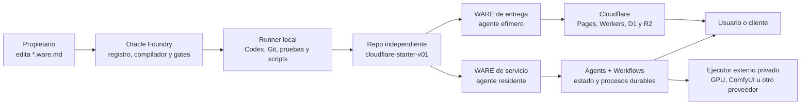

# LMWARES + Oracle

## Arquitectura del sistema ensamblador

Fecha de decisión: 2026-07-10  
Estado: arquitectura acordada; implementación pendiente  
Repositorio de Oracle: `C:\dev\oracle`  
Chasis de proyectos: `pixatrip1984/cloudflare-starter`, rama `cloudflare-starter-v01`

## 1. Definición ejecutiva

LMWARES no es un page builder ni una colección de plantillas. Es una fábrica de
software dirigido por intención:

1. Una persona describe un producto y sus cambios en un archivo Markdown.
2. Oracle interpreta ese contrato, prepara un plan y dirige a un agente.
3. El agente ensambla el proyecto sobre un chasis conocido.
4. Oracle valida cada fase, conserva evidencia y solicita las aprobaciones
   necesarias.
5. El resultado se ejecuta sobre una arquitectura Cloudflare administrada.

La taxonomía oficial es:

| Elemento | Responsabilidad |
| --- | --- |
| LMWARES | Marca, metodología y ecosistema de productos ensamblables. |
| Oracle | Foundry y taller interno para proyectos, agentes, fases, evidencia y despliegues. |
| `cloudflare-starter` | Chasis técnico reutilizable para aplicaciones web. |
| `*.ware.md` | Contrato editable entre el propietario y el agente. |
| `ware.lock.json` | Plan compilado, determinista y no editable a mano. |
| Proyecto derivado | Repo independiente que contiene el producto real. |
| AstraMuses | Primer producto insignia y primera referencia dual de WARE. |

Oracle es inicialmente una herramienta para que el propietario construya sus
propios proyectos. El marketplace y la ejecución de WAREs de terceros son una
etapa posterior, no una condición para validar el modelo.

## 2. Promesa del producto

La unidad comercial no es una página ni un prompt. Es un sistema reproducible:

```text
intención editable
  + componentes reutilizables
  + agente ejecutor
  + infraestructura conocida
  + validación por fases
  + evidencia y trazabilidad
  = WARE desplegable
```

LMWARES puede producir dos familias de resultados:

### 2.1 WARE de entrega

El agente ensambla, prueba, despliega y entrega un producto. Después puede
abandonar la ejecución cotidiana.

Ejemplos:

- Sitio de servicios.
- Catálogo.
- Tienda sin pagos.
- Portal de solicitudes.
- Landing operativa.
- Sitio con panel administrativo.

### 2.2 WARE de servicio

El producto requiere un agente o proceso persistente después del despliegue.
El agente permanece como operador, coordinador o interfaz viva.

Ejemplos:

- Producción continua de campañas.
- Revisión y aprobación de contenido.
- Atención operativa.
- Procesamiento de documentos.
- Monitoreo y flujos con intervención humana.

Ambos tipos comparten el mismo contrato, las mismas fases y el mismo sistema de
evidencia. Cambia el ciclo de vida del agente.

## 3. Arquitectura general



## 4. Límites de responsabilidad

### 4.1 Oracle local

Oracle puede leer repos en `C:\dev`, consultar Git, ejecutar validaciones y
preparar cambios porque corre en el equipo del propietario.

Responsabilidades:

- Descubrir proyectos.
- Leer contratos WARE.
- Compilar planes.
- Abrir ejecuciones aisladas.
- Invocar al agente de desarrollo.
- Ejecutar validadores locales.
- Conservar evidencia.
- Preparar, pero no autorizar por sí solo, staging remoto.

### 4.2 Control plane remoto

Cuando sea necesario sincronizar Oracle entre equipos, Cloudflare puede guardar
el registro, las aprobaciones y la evidencia. Un Worker remoto no puede acceder
directamente a `C:\dev`; necesitará un runner local que inicie conexiones
salientes autenticadas.

### 4.3 Runtime de cada proyecto

Cada proyecto mantiene recursos separados:

- Aplicación pública.
- Portal privado.
- API pública.
- API privada.
- D1.
- R2.
- Access y Turnstile.
- Workflows, Agents, Queues o Durable Objects solo cuando el producto los
  requiera.

Oracle nunca debe convertir todos los proyectos en un único monolito.

## 5. Contrato `*.ware.md`

### 5.1 Principio

El Markdown es la interfaz humana y la fuente de intención. No es código
arbitrario ni un script con permisos implícitos.

El propietario puede modificarlo con cualquier editor y entregarlo al agente.
Oracle debe poder:

- Validar su estructura.
- Identificar qué cambió.
- Detectar ambigüedades.
- Generar un plan.
- Mostrar impacto y riesgos.
- Exigir aprobación antes de acciones sensibles.

### 5.2 Estructura por repo

```text
.lmwares/
  project.json
  <producto>.ware.md
  ware.lock.json
  changes/
    CR-0001.md
  runs/
    <run-id>/
      plan.json
      evidence.json
      validation.md
```

`project.json` funciona como índice operativo pequeño. El `*.ware.md` contiene
la intención. `ware.lock.json` es generado por Oracle. Los directorios de
ejecución contienen evidencia y no reemplazan a Git.

### 5.3 Front matter propuesto

```yaml
---
schema: lmwares.ware/v1
id: astramuses-site
project: astramuses
kind: artifact
version: 0.1.0
base:
  repository: pixatrip1984/cloudflare-starter
  ref: cloudflare-starter-v01
designSystem: lmwares-editorial-scene/v1
agentLifecycle: exit-after-handoff
deployment:
  provider: cloudflare
  environment: local
permissions:
  filesystem:
    - repo
  network: documentation-only
  deploy: denied
secrets:
  - ref: cloudflare/astramuses/turnstile
---
```

Los campos de `secrets` son referencias simbólicas. Los valores nunca aparecen
en Markdown, Git, prompts, logs ni archivos de evidencia.

### 5.4 Secciones humanas

El propietario controla:

- Propósito.
- Usuario objetivo.
- Oferta y resultado esperado.
- Alcance y exclusiones.
- Dirección visual.
- Componentes reutilizables.
- Cambios solicitados.
- Elementos protegidos.
- Criterios de aceptación.
- Decisiones y aprobaciones.

Ejemplo:

```markdown
## Cambios solicitados

### CR-0014 — Variación vertical de la pantalla Models

Estado: solicitado

Quiero conservar el objeto visual central y llevar los mensajes a la periferia
superior e inferior. No alterar el catálogo ni las rutas.

#### Criterios de aceptación

- La composición funciona a 390 x 844.
- El objeto visual conserva jerarquía central.
- No hay texto encima de las imágenes.
- El cambio no altera desktop.

#### Elementos protegidos

- Catálogo de modelos.
- Animación de entrada del grafo en desktop.
```

### 5.5 Secciones del agente

Oracle delimita las zonas que el agente puede actualizar:

```markdown
<!-- oracle:agent-report:start -->
## Informe del agente

Estado: pendiente
Plan: pendiente
Evidencia: pendiente
<!-- oracle:agent-report:end -->
```

El agente no reescribe las secciones humanas sin autorización. Si necesita
corregir una ambigüedad, agrega una pregunta o propuesta en su bloque.

### 5.6 Compilación

Oracle transforma la intención en `ware.lock.json` con:

- Hash de la revisión fuente.
- Tipo y versión del WARE.
- Chasis exacto.
- Módulos y versiones.
- Plan de fases.
- Entradas y salidas.
- Adaptadores permitidos.
- Permisos efectivos.
- Validadores obligatorios.
- Gates humanos.
- Recursos Cloudflare requeridos.
- Estrategia de rollback.

La versión 1 no ejecuta shell escrito dentro del Markdown. Solo permite
operaciones conocidas mediante adaptadores con allowlist.

## 6. Flujo de cambios

1. El propietario edita `Cambios solicitados`.
2. Oracle calcula la diferencia semántica y asigna un ID.
3. El agente devuelve plan, impacto, riesgos y validadores.
4. El propietario aprueba o corrige el plan.
5. Oracle crea un run y una rama o worktree aislado cuando corresponda.
6. El agente implementa únicamente el alcance aprobado.
7. Oracle ejecuta validaciones.
8. El agente escribe evidencia y resultado.
9. El propietario acepta, solicita cambios o autoriza la fase siguiente.
10. Oracle registra la decisión y actualiza el índice del proyecto.

Una solicitud de diseño no autoriza despliegues. Una aprobación de fase no
autoriza compra de recursos, dominio final, datos reales ni publicación abierta.

## 7. Cinco fases canónicas

Oracle debe migrar del estado actual de cuatro fases a este modelo:

### Fase 1 — Contrato

Objetivo: convertir intención en un alcance verificable.

Entregables:

- `*.ware.md` válido.
- Dependencias y módulos identificados.
- Criterios de aceptación.
- Permisos y exclusiones.
- Plan de datos y arquitectura.

Gate: aceptación del propietario.

### Fase 2 — Experiencia visual

Objetivo: demostrar qué se está comprando.

Entregables:

- Navegación real.
- Pantallas principales.
- Diseño horizontal, vertical y móvil.
- Objeto visual dominante.
- Datos simulados seguros cuando sean necesarios.

Gate: aprobación visual explícita.

### Fase 3 — Operación local

Objetivo: reemplazar simulaciones con operación útil.

Entregables:

- Workers y contratos validados.
- D1 local con migraciones.
- R2 o política de archivos.
- Portal operativo.
- Estados, notas y auditoría.
- Workflows o agentes locales cuando apliquen.

Gate: pruebas locales y aceptación del flujo.

### Fase 4 — Validación

Objetivo: demostrar calidad y seguridad antes de exponer infraestructura.

Entregables:

- Typecheck, build y pruebas.
- QA visual y responsive.
- Threat model y revisión de permisos.
- Inventario de secretos y plan de rotación.
- Pruebas de abuso y privacidad.
- Evidencia de rollback.

Gate: autorización específica para preparar staging.

### Fase 5 — Cloudflare staging

Objetivo: desplegar infraestructura real bajo subdominios administrados.

Entregables:

- Aplicaciones pública y privada.
- Workers público y privado.
- D1 y R2 separados.
- Access activo.
- Turnstile real.
- CORS exacto.
- Claves rotadas y secretos establecidos fuera de Git.
- Smoke test con datos de prueba.

Gate: revisión final. El dominio comercial definitivo sigue siendo una decisión
separada.

## 8. Subsistemas de Oracle

### 8.1 Registro de proyectos

Evolución del escáner actual:

- Descubrir repos en una raíz configurable.
- Leer Git sin modificarlo.
- Detectar `project.json` y `*.ware.md`.
- Mostrar estado confirmado, inferido o inválido.
- Mantener compatibilidad temporal con manifests schema v1.

### 8.2 Parser y validador WARE

- Parsear front matter y secciones Markdown.
- Validar schema y referencias.
- Generar diagnósticos con ubicación.
- Rechazar valores de secretos.
- Rechazar permisos desconocidos.
- Calcular hash y versión de revisión.

### 8.3 Compilador

- Resolver módulos.
- Preparar el plan por fases.
- Producir `ware.lock.json`.
- Mantener salida determinista para la misma entrada.

### 8.4 Planner y adaptador de agente

- Construir un prompt a partir del contrato compilado.
- Incluir únicamente contexto necesario.
- Limitar el repo y permisos.
- Conservar la respuesta estructurada del agente.
- No depender de un proveedor específico en el contrato WARE.

### 8.5 Runner local

- Ejecutar Git, npm y scripts del starter.
- Aislar ejecuciones.
- Capturar stdout, stderr, código de salida y duración.
- Cancelar y reanudar de forma controlada.
- No aceptar comandos arbitrarios provenientes del WARE.

### 8.6 Validadores

- Estructura del repo.
- TypeScript.
- Build.
- Workers dry-run.
- D1 migrations.
- QA de navegador.
- Seguridad y configuración de staging.
- Validadores específicos por WARE.

### 8.7 Evidencia y aprobaciones

- Registro append-only de acciones importantes.
- Resultado por fase.
- Artefactos y capturas.
- Aprobación, rechazo y comentarios del propietario.
- Identidad del agente y versión de herramientas.

### 8.8 Broker de despliegue

El broker prepara perfiles y comandos, pero no despliega sin autorización.

- Recursos por proyecto.
- Tokens con mínimo privilegio.
- Secret refs, nunca valores.
- Dry-run antes de cualquier mutación.
- Registro de qué versión fue desplegada.
- Rollback verificable.

## 9. AstraMuses como referencia dual

AstraMuses cumple dos funciones dentro de LMWARES.

### 9.1 Producto construido con LMWARES

`astramuses-site.ware.md` debe describir:

- Sitio editorial.
- Catálogo de modelos.
- Perfil detallado de cada modelo.
- Paquetes de posts, reels y modelaje.
- Captación de solicitudes.
- Portal de seguimiento.
- Identidad de marca `Built with LMWARES`.

Tipo: `artifact`.  
Ciclo del agente: `exit-after-handoff`.

### 9.2 Servicio LMWARES

`astramuses-social.ware.md` debe describir:

- Brief de campaña.
- Selección de paquete.
- Casting de modelos.
- Plan de piezas.
- Generación.
- Control de calidad.
- Revisión humana.
- Aprobación del cliente.
- Entrega y trazabilidad.

Tipo: `service`.  
Ciclo del agente: `resident`.

Los dos WAREs pueden compartir catálogo, perfiles, componentes visuales y
contratos de activos, pero se versionan por separado para poder venderlos,
instalarlos y evolucionarlos de forma independiente.

El agente de Oracle puede leer AstraMuses como referencia cuando se le autorice,
pero no debe modificar `C:\dev\astramuses`. El trabajo de AstraMuses continúa en
su propio repo y con su propio agente.

## 10. Gramática visual LMWARES

La demostración de AstraMuses define una gramática, no una plantilla única.

Principios:

- Una escena editorial en lugar de una landing genérica.
- Un objeto visual central o dominante.
- Información en la periferia.
- Tensión entre esquinas opuestas.
- Titulares divididos manualmente.
- Mensajes suaves y secundarios.
- Movimiento lento, claro y controlado.
- Un objeto distinto según la idea de cada pantalla.

Primitivas reutilizables:

- Marco translúcido.
- Mancha atmosférica.
- Mensaje amarillo suave.
- Bloque tipográfico blanco.
- Ranuras periféricas NW, NE, SW y SE.
- Entrada del objeto como una sola unidad.
- Tokens de marca sustituibles por proyecto.

Recetas de composición:

- Horizontal periférica.
- Vertical periférica.
- Diagonal.
- Eje desplazado.
- Matriz.
- Sistema orbital.
- Timeline.
- Collage o catálogo.

El `.ware.md` elige una receta y define el objeto de cada pantalla. No se copia
el grafo de AstraMuses en todos los proyectos. El portal operativo prioriza
claridad, cola de trabajo y acciones por encima de decoración.

## 11. Arquitectura Cloudflare

La base actual del starter se conserva:

```text
Public web  ─▶ Public API Worker ─▶ D1 / R2
Admin web   ─▶ Cloudflare Access ─▶ Admin API Worker ─▶ D1 / R2
```

Reglas:

- React no accede directamente a D1 ni R2.
- La API pública solo expone datos públicos y entradas validadas.
- La API privada verifica Cloudflare Access.
- Turnstile se valida en servidor.
- CORS usa orígenes exactos.
- Los secretos no usan `VITE_*`.
- Los binarios viven en R2; D1 conserva estado y metadatos.

Para servicios persistentes:

- Workflows ejecuta pasos durables, reintentos y esperas de aprobación.
- Agents conserva identidad, comunicación y estado interactivo.
- Queues desacopla trabajo asíncrono cuando el volumen lo requiera.
- Durable Objects se reserva para coordinación con consistencia por entidad.

La documentación oficial describe Workflows como ejecución durable de varios
pasos con reintentos, eventos externos y aprobaciones. Agents y Workflows son
complementarios: el agente mantiene interacción e identidad; el workflow
ejecuta procesos de larga duración.

Referencias:

- [Cloudflare Workflows](https://developers.cloudflare.com/workflows/)
- [Agents con Workflows](https://developers.cloudflare.com/agents/concepts/workflows/)
- [Dynamic Workflows](https://developers.cloudflare.com/dynamic-workers/usage/dynamic-workflows/)
- [Workers for Platforms: dynamic dispatch](https://developers.cloudflare.com/cloudflare-for-platforms/workers-for-platforms/configuration/dynamic-dispatch/)

Dynamic Workflows y Workers for Platforms se evaluarán para el marketplace de
terceros. No forman parte del primer MVP de Oracle.

## 12. Ejecutor GPU y herramientas locales

ComfyUI y otros motores GPU no deben exponerse directamente al navegador ni
integrarse como middleware de Vite en producción.

Separación propuesta:

1. Oracle crea un job con identificador y contrato firmado.
2. Un executor privado reclama el job mediante una conexión autenticada.
3. El executor procesa los activos.
4. Los resultados aprobados se suben a R2.
5. D1 registra estado, checksums y trazabilidad.
6. El workflow continúa con QA o aprobación humana.

Las herramientas de producción viven en Oracle. El portal de AstraMuses solo
muestra estados, revisiones, aprobaciones y entregas pertinentes al operador o
cliente.

## 13. Modelo de datos conceptual

Oracle necesitará, como mínimo:

- `Project`
- `WareDefinition`
- `WareRevision`
- `ChangeRequest`
- `Run`
- `PhaseResult`
- `ValidationResult`
- `Evidence`
- `Approval`
- `DeploymentRecord`
- `SecretReference`
- `AuditEvent`

AstraMuses necesitará extender el dominio genérico del starter con:

- `OfferPackage`
- `Campaign`
- `Brief`
- `CastingSelection`
- `ContentItem`
- `GenerationJob`
- `Asset`
- `Review`
- `Approval`
- `Delivery`
- `WorkflowInstance`
- `AgentRun`

La primera versión de Oracle puede persistir contratos y evidencia en archivos
versionados. D1 se incorpora cuando exista un flujo remoto real que lo justifique.

## 14. Seguridad y rotación de claves

La rotación de claves es un gate obligatorio antes de pruebas remotas, pero no
sustituye un diseño seguro.

### 14.1 Reglas de secretos

- Inventariar credenciales sin imprimir valores.
- Rotar antes de staging.
- Usar credenciales distintas por ambiente y proyecto.
- Aplicar mínimo privilegio.
- Guardar valores en secretos de Workers o mecanismo equivalente.
- Mantener solo referencias en el WARE.
- Revocar credenciales al cerrar una ejecución o proveedor.
- Evitar tokens maestros compartidos entre proyectos.

### 14.2 Gates

- Threat model antes de staging.
- Auditoría de dependencias y rutas sensibles.
- Access activo en portal y API privada.
- Turnstile activo en entradas públicas.
- Bypasses locales deshabilitados.
- CORS exacto.
- Datos de prueba hasta autorización.
- Auditoría append-only.
- Rollback probado.

### 14.3 Permisos del agente

- Scope de filesystem explícito.
- Red limitada a documentación salvo autorización.
- Sin despliegue implícito.
- Sin compra de recursos.
- Sin modificación de otros repos.
- Sin acceso a valores de secretos en prompts o logs.
- Acciones externas importantes requieren aprobación humana.

## 15. Qué se rescata de APP1 y 3chat

APP1 no se migra como monolito. Se utiliza como cantera de ideas:

- Contratos WARE con entradas, salidas, políticas y pasos.
- Grafo visual de tareas y agentes.
- Exportación e importación de workflows.
- Generación de código y componentes reutilizables puntuales.

3chat conserva valor como futuro editor visual del plan compilado. No será la
fuente de verdad ni el runtime. La fuente de verdad es `*.ware.md`; el grafo es
una vista y editor controlado sobre ese contrato.

No se heredan:

- El monolito completo.
- APIs sensibles sin autenticación de servidor.
- Dependencia de credenciales de proveedor dentro del frontend.
- Estado canónico solo en `localStorage`.
- Page builder universal como núcleo de LMWARES.

## 16. Estado actual verificado

### Oracle

- Parte de `cloudflare-starter-v01`.
- Tiene un escáner local de repos en `C:\dev`.
- Lee `.lmwares/project.json`, Git y señales estructurales.
- Genera un JSON estático para la vista de proyectos.
- Su contrato comercial genera un prompt de desarrollador.
- El typecheck completo pasa.
- Todavía no compila WAREs, ejecuta fases ni conserva runs estructurados.

### AstraMuses

- Parte de `cloudflare-starter-v01`.
- Tiene aplicaciones pública y privada, Workers, D1 y R2 base.
- Los Workers pasan `wrangler --dry-run`.
- El diseño editorial está documentado.
- El dominio persistido sigue siendo genérico: publicaciones y solicitudes.
- La herramienta `#control` depende de middleware local de Vite y rutas locales
  de ComfyUI/Codex.
- La web pública tiene errores TypeScript pendientes en catálogo/herramientas.
- El manifest `.lmwares/project.json` solo registra cuatro fases y estado básico.

## 17. Roadmap de implementación

### Milestone 1 — Contrato y compilador local

- Schema `lmwares.ware/v1`.
- Parser Markdown + front matter.
- Diagnósticos y secret scanning estructural.
- `ware.lock.json` determinista.
- Compatibilidad con `project.json` schema v1.
- Primer WARE de Oracle como fixture local.
- Typecheck, tests y documentación.

### Milestone 2 — Registro y runs

- Proyectos y revisiones en la UI.
- Change requests.
- Runs y evidencia.
- Gates de aprobación.
- Adaptador local de agente sin proveedor acoplado al contrato.

### Milestone 3 — Validadores y componentes

- npm, TypeScript, build, Worker dry-run y D1.
- QA de navegador.
- Biblioteca de módulos reutilizables.
- Gramática visual `lmwares-editorial-scene/v1`.

### Milestone 4 — AstraMuses dual

- Dos WAREs independientes.
- Separación de web pública, portal y herramientas Oracle.
- Dominio de campañas.
- Workflow durable y executor privado.
- R2 para activos aprobados.

### Milestone 5 — Seguridad y staging

- Auditoría completa.
- Rotación de claves.
- Managed profile por proyecto.
- Access, Turnstile, CORS y secretos.
- Smoke tests remotos.
- Evidencia y rollback.

### Futuro — Marketplace

- Firma y procedencia de WAREs.
- Revisión automatizada y humana.
- Sandboxing de extensiones.
- Permisos y egress declarados.
- Facturación, límites y reputación.
- Dynamic Workflows o Workers for Platforms cuando el modelo first-party esté
  demostrado.

## 18. Criterios de aceptación de Oracle v1

Oracle v1 queda validado cuando:

1. Lee un `*.ware.md` real.
2. Devuelve diagnósticos claros sin modificar el repo.
3. Produce un lock determinista y sin secretos.
4. Registra una solicitud de cambio.
5. Prepara un plan de agente limitado al repo.
6. Ejecuta validadores locales autorizados.
7. Conserva evidencia por fase.
8. Exige aprobación antes de mutaciones remotas.
9. Mantiene compatibilidad con los proyectos actuales.
10. Puede describir AstraMuses como WARE de entrega y WARE de servicio sin
    modificar su repo.

## 19. No objetivos del primer ciclo

- Marketplace público.
- Ejecución de código arbitrario de terceros.
- Page builder universal.
- Migración completa de APP1.
- Despliegue automático sin aprobación.
- Dominio final de clientes.
- Administración de claves mediante Markdown.
- Modificación de AstraMuses desde el agente de Oracle.

## 20. Decisión de marca

AstraMuses será la primera demostración pública de origen:

```text
Built with LMWARES
```

Los productos que consuman su servicio podrán mostrar:

```text
Powered by AstraMuses, a LMWARES service
```

Esto permite que LMWARES demuestre simultáneamente su capacidad para construir
productos terminados y para operar servicios vivos.
