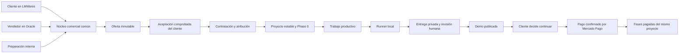

# Oracle: plan maestro de venta asistida y contratación unificada

Fecha: 2026-09-09. Estado: DISEÑO PARA IMPLEMENTACIÓN POSTERIOR. No implementado por este documento.

## 0. Cómo ejecutar este plan

Este documento define la arquitectura y las decisiones normativas del Seller MVP. Se completa con:

- [Contratos técnicos, datos, terminal y motor Flash](LMWARES-ORACLE-SELLER-CONTRACTS-2026-09-09.md).
- [Etapas ejecutables y estrategia de activación](LMWARES-ORACLE-SELLER-STAGES-2026-09-09.md).
- [Matriz de pruebas, fallos y aceptación](LMWARES-ORACLE-SELLER-VALIDATION-2026-09-09.md).

Un agente recibe una etapa, sus dependencias verificadas y estos cuatro documentos. No decide de nuevo políticas fijadas aquí. Una desviación requiere documentar motivo, alternativas, contratos afectados y decisión del responsable. Terminar una etapa no autoriza por sí mismo desplegar ni activar producción.

El trabajo de esta sesión se limita a documentación: no ejecutar runners, generar demos, consultar secretos, migrar bases, enviar comunicaciones ni publicar. El runner local ya configurado permanece detenido. Las comprobaciones de código son locales; no constituyen una nueva verificación de producción.

## 1. Resultado y frontera del MVP

El vendedor entra a Oracle desde su teléfono, encuentra o registra cliente y negocio, captura una necesidad, configura Starter/Pro, obtiene un borrador de Flash, lo revisa y presenta. El cliente recibe un código en su correo, toma temporalmente el dispositivo y acepta esa propuesta. Oracle registra aceptación, atribución, proyecto, Phase 0 y trabajo de demo. El dispositivo vuelve al vendedor sin sesión del cliente. Más tarde, el cliente entra por su identidad verificada y encuentra su contratación.

El mismo resultado se obtiene desde el canal autónomo y desde una operación preparada internamente. Las diferencias son procedencia, participantes y política de revisión antes de emitir; no hay un motor de contratación por canal.

Incluye: representante principal, empresas múltiples, búsqueda limitada contra duplicados, borradores recuperables, terminal y aceptación remota, propuestas versionadas, promoción autorizada, una ronda de ajustes de demo, conversación comercial mínima, Mercado Pago, runner local, revisión humana, seguimiento y recuperación.

Excluye: Free asistido, CRM general, operación offline completa, WhatsApp/SMS como identidad, invitaciones autogestionadas de múltiples representantes, marketplace, comisiones/payouts, custodiar dinero ajeno, reputación, asignación automática de vendedores, generación libre de software mediante herramientas arbitrarias, promesas de posicionamiento o resultados comerciales.

## 2. Decisiones de producto confirmadas

| ID | Decisión vinculante |
|---|---|
| P01 | México; prestador persona física operando como LMWares. No inventar una sociedad. |
| P02 | Nombre declarado del aceptante, control de correo y declaración digital de autoridad. Controversias por revisión administrativa. |
| P03 | Terminal en dispositivo del vendedor, autorización de una sola operación y versión; nunca sesión normal del cliente. |
| P04 | Sin acceso al correo se guarda pendiente; no hay cierre alternativo del vendedor. |
| P05 | Vendedor captura contexto; Flash propone dentro de paquete/capacidades/reglas; vendedor revisa antes de presentar. |
| P06 | Descuentos solo autorizados; excepción administrativa vinculada a la versión exacta. |
| P07 | Modelo admite varios representantes; interfaz MVP con uno principal. |
| P08 | Correos compartidos permitidos; nombre de quien declara aceptar conservado por acto. |
| P09 | Vendedor detecta coincidencias básicas; no adquiere historiales de otros vendedores. |
| P10 | Free continúa su flujo determinista independiente; no se le agrega Phase 0 contractual. |
| P11 | Borradores resistentes a desconexión; servidor confirma todo acto definitivo. |
| P12 | Tras demo, decisión explícita de continuar; no repetir firma completa si no cambió lo aceptado. |
| P13 | Una ronda de preferencias gratuita; defectos nuestros no la consumen; nueva dirección es cambio de alcance. |
| P14 | Precio/descuento disponibles siete días desde la presentación efectiva de la demo según sección 10. |
| P15 | Demo pública treinta días si no continúa económicamente; avisar antes; retirar publicación no borra expediente ni código. |
| P16 | Solo Mercado Pago confirma dinero en MVP. El vendedor no marca pagos. |
| P17 | No existen comisiones devengadas ni porcentajes aprobados. Preservar hechos, no inventar derechos. |
| P18 | Atribución por operación; importa llevarla a aceptación válida. Procedencia histórica no reserva al cliente. |

Los porcentajes orientativos futuros del usuario (vendedor 10–20 %, ejecutor 70–80 %, resto plataforma) son una visión, no configuración, ni promesa, ni base de una liquidación. No se suman ni se normalizan en este MVP.

## 3. Estado encontrado y correcciones necesarias

| Área | Evidencia local | Consecuencia del diseño |
|---|---|---|
| Identidad | `workers/public-api/src/routes/auth.ts`, `packages/db/src/repositories/lmwares-auth.ts`; Google/OIDC y sesiones HttpOnly; email no es clave única de usuario | Añadir credencial de correo comprobada y resolución de identidades; nunca fusionar por mera coincidencia. |
| Contratación | `lmw_package_intakes` y ofertas exigen `user_id`; aceptación en `routes/commercial-intakes.ts` exige sesión del titular | Permitir preparación sin cuenta; operación común y prueba restringida del cliente. |
| Oferta | `lmwares-commercial-offers.ts` versiona, pero `applyDiscountToOffer` y selección de mantenimiento modifican importes tras aceptar | Precio neto y obligaciones se congelan antes del consentimiento; elecciones futuras son registros adicionales. |
| Phase 0 | Migración 0039; lifecycle, fases, subdominio y pagos habilitados al cerrar demo | Conservar datos, unificar identidad de proyecto, añadir continuación explícita y separar reloj comercial/publicación. |
| Runner | Migración 0040, `commercial-agent-internal.ts`, `scripts/lmwares-commercial-demo-runner/cli.mjs` | Reutilizar adaptador/localización; mejorar prueba de asignación, revisiones, entregas y recuperación. |
| Alcance IA | `commercial-scope-agent.ts`: descripciones breves, texto libre y regex; contiene escapes dobles que deben verificarse con pruebas | Migrar a catálogo estructurado y compilador contractual. Un prompt o regex no es control de autoridad suficiente. |
| Demo actual | Clona starter y genera `demo/index.html` desde contenido JSON y plantilla determinista | Es adaptador de demo pública, no ejecutor general de código. Mantener esa distinción. |
| Admin | `requireWrite` se usa para oferta, publicación y fases; roles owner/admin/editor/viewer | Crear vendedor propio; aprobación de producción separada de edición. |
| Ajustes | Plan anterior describe hilo y solicitud de cambios; no encontrados en flujo comercial inspeccionado | Implementación necesaria, no dependencia supuestamente resuelta. |
| Avisos | Existe infraestructura `lmw_notifications`; avisos operativos actuales son best-effort; tabla operacional prevista | Persistir evento y entrega recuperable. Telegram no coordina el estado empresarial. |
| Medios | Proxy genérico `/media/<key>` excluye algunos prefijos privados pero no todos los futuros contractuales/de revisión | Allowlist de assets públicos; cerrar acceso alternativo a evidencias, entregas y contratos. |
| Documentación | `LMWARES-COMMERCIAL-FLOW-ON-GO-LIVE.md` todavía denomina Phase 0 a revisión previa y habla de cobros al aceptar | Sustituir esas afirmaciones al implementar; revisión comercial previa NO es Phase 0. |

La visión de agosto asociaba ingresos del negociador a trabajo que llega a pago. La decisión actual conserva el cierre comercial en la aceptación y deja pendiente el devengo económico. Son hitos distintos y no se atribuye comisión a ninguno todavía.

## 4. Arquitectura elegida

### 4.1 Monolito modular sobre la infraestructura existente

Mantener TypeScript/Hono, D1 como fuente relacional y R2 privado para artefactos. Extraer un núcleo `packages/commercial` con servicios de aplicación compartidos, políticas puras en `packages/domain`, validación en `packages/validation` y persistencia en `packages/db`.

- `apps/sales-web`: superficie móvil del vendedor, visualmente Oracle, sin navegación administrativa.
- `workers/sales-api`: API de vendedores; autentica personal y aplica permisos por operación. No monta rutas de admin ni usa sus credenciales.
- `apps/admin-web` / `workers/admin-api`: supervisión, políticas, asignaciones, excepciones, revisiones productivas y controversias.
- `apps/public-web` / `workers/public-api`: autoservicio y cuenta del cliente; terminal separado por origen y permisos.
- `workers/commercial-async`: consumidor de tareas de alcance/outbox/notificaciones; comparte el núcleo. La cola transporta avisos de trabajo, no define derechos empresariales.
- Runner local: consumidor saliente autorizado de trabajos de producción; no recibe permisos comerciales, financieros ni de publicación.

La guía Cloudflare orienta esta separación: D1 para estado y transacciones, R2 privado para bytes, cola para latencia y reintento, y runner saliente para filesystem local. No agregar Durable Objects, event sourcing completo, una base por vendedor o un motor de workflows genérico en el MVP.

### 4.2 Un solo registro operativo comercial

Crear `lmw_commercial_operations` como la raíz canónica y enlazar uno a uno los `lmw_package_intakes` heredados mediante una tabla de compatibilidad. La migración original hace `user_id` obligatorio y varias referencias históricas dependen de ella; reconstruir esa tabla en D1 para volverlo opcional sería una migración de alto riesgo y no resolvería que una oferta nueva todavía depende de un intake autenticado. El adaptador web seguirá creando/enlazando una operación; los intakes y ofertas actuales conservan sus IDs y quedan como proyección legacy hasta que las rutas se trasladen. No son dos pipelines: la operación es la fuente de verdad nueva y el legado es un adaptador transitorio.

No crear `seller_intakes` ni copiar una venta aceptada a un pipeline web. Ambos canales escriben esa misma operación y usan las mismas ofertas. `user_id` heredado se vuelve pista de compatibilidad/creador autenticado, no autoridad universal del titular.

Una operación nueva produce una contratación y un proyecto en MVP. Recontratar otro sitio produce otra operación. Una enmienda o renovación de condiciones del mismo trabajo conserva contratación y proyecto. Futuras ampliaciones pueden referenciar un proyecto existente, sin habilitar esa variante por accidente ahora.

### 4.3 Unidad de coordinación

Aceptación, continuación, pago y aprobación son comandos distintos. El estado y un evento/outbox se escriben en la misma transacción D1. Entrega de email, Telegram, R2, DeepSeek y Mercado Pago ocurren fuera y son recuperables. No prometer una transacción distribuida entre servicios.

La documentación de D1 describe `batch()` como transaccional. Un UPDATE que afecta cero filas no produce necesariamente error: todas las escrituras dependientes deben quedar condicionadas al mismo resultado exitoso; las pruebas de concurrencia son obligatorias. [D1 Database](https://developers.cloudflare.com/d1/worker-api/d1-database/).

Cloudflare Queues puede entregar un mensaje más de una vez; los consumidores deduplican por ID empresarial persistido. El outbox y el reconciliador rescatan el evento aunque falle el envío a la cola. [Garantías de entrega](https://developers.cloudflare.com/queues/reference/delivery-guarantees/).

El trabajo prolongado no dependerá de `waitUntil` después de responder HTTP. Su vida está limitada; solo puede servir para acelerar un despacho ya persistido. [Context de Workers](https://developers.cloudflare.com/workers/runtime-apis/context/).

### 4.4 Alternativas consideradas y frontera elegida

| Decisión | Alternativa descartada para MVP | Razón concreta |
|---|---|---|
| Evolucionar intake común | Nueva solicitud seller convertida después a solicitud web | Duplicaría negociación, descuentos, estados e idempotencia. |
| Customer y membresías separados de login | Asignar todo por email | Correos cambian/se comparten y no acreditan autoridad sobre empresas existentes. |
| Terminal con grant transaccional | Login cliente en navegador del vendedor | Dejaría acceso a su cuenta e historial después de la visita. |
| API Sales con núcleo compartido | Dar rol editor/admin a vendedor y ocultar botones | Seguiría autorizando producción y datos ajenos en el backend. |
| SQL transaccional + outbox | Event sourcing total o servicios por cada entidad | No aporta valor proporcional con este volumen; aumenta reconstrucción y coordinación. |
| Compilador contractual desde capacidades | Confiar solo en un system prompt y blacklist de palabras | No impide obligaciones inventadas ni cantidades/plazos fuera de reglas. |
| WorkItems mínimos con leases | Marketplace completo o job sin heartbeat/fencing | El primero excede MVP; el segundo ya falla con reintentos y un runner desconectado. |
| Snapshot de hechos de atribución | Calcular porcentajes orientativos ahora | No existe política ni promesa económica definida; generaría derechos ficticios. |

Las tablas de identidad, consentimiento, reservas y entregas reflejan invariantes distintas; no implican un microservicio por tabla. Los nuevos workers son límites de autorización/ejecución y comparten código, D1 y protocolos. No desplegar una infraestructura de mercado por anticipación.

## 5. Modelo conceptual e identidad

| Concepto | Qué representa | Qué no representa |
|---|---|---|
| Cuenta de acceso | Identidad autenticable estable, métodos vinculados y correos comprobados | Una empresa, un contrato o una prueba civil de una persona |
| Cliente / Customer | Parte receptora de la relación comercial; persona física o entidad declarada | El vendedor ni una fila global deducida por email |
| Negocio / Business | Marca, establecimiento o actividad del cliente | Necesariamente una persona moral distinta |
| Representación / Membership | Permiso de una cuenta para actuar por un cliente, con rol y procedencia | Propiedad obtenida por escribir el nombre de un negocio |
| Contacto pendiente | Nombre y correo aportados durante preparación | Usuario autenticado ni representante ya autorizado |
| Vendedor / SalesActor | Integrante habilitado para gestiones comerciales | Administrador, cliente o desarrollador por defecto |
| Operación | Necesidad y negociación concreta | Propiedad permanente de un cliente |
| Oferta | Versión precisa de prestaciones, límites, precio y condiciones | Borrador mutable ni texto libre convertido automáticamente en obligación |
| Aceptación | Acto específico sobre oferta/identidad/representación | Login, pago, aprobación técnica ni aceptación del vendedor |
| Contratación | Relación estable nacida de la aceptación inicial y sus enmiendas | Cuenta bancaria o tarea ejecutable |
| Proyecto | Identidad duradera del producto adquirido | Ruta local, subdominio, tarea, contrato o pago |
| Fase / Trabajo / Entrega | Hito productivo / unidad ejecutable / resultado presentado | Una comisión ni un pago de cliente |

Un cliente puede tener varios negocios y cada negocio varias operaciones/proyectos. Una cuenta puede representar a varios clientes y un cliente tener varias cuentas representantes. En MVP se expone el representante principal; no se impone una restricción SQL de un único miembro.

Un negocio de persona física puede llevar nombre comercial sin RFC capturado en la visita. El contrato debe distinguir nombre del contratante y nombre del negocio. Datos de facturación no convierten automáticamente a otro tercero en titular. El prestador se configura como persona física; su identidad legal no se rellena con la marca LMWares.

### 5.1 Correos compartidos y persona declarada

Conservar en cada aceptación: cuenta/controlador del buzón, correo comprobado, nombre declarado de la persona, capacidad declarada, texto y versión de declaración, método de verificación y momento. Dos personas que usan el mismo buzón pueden actuar a través de una misma cuenta de acceso; no se inventan dos identidades civiles verificadas.

La interfaz dirá «correo verificado» y «nombre declarado», no «identidad personal certificada». El nombre de una nueva aceptación nunca modifica el nombre preservado en una aceptación anterior. Para añadir representantes independientes posteriormente se usarán cuentas/membresías propias.

### 5.2 Alta, retorno y vinculación

1. El vendedor crea contacto pendiente y operación, sin sesión/usuario ficticio del cliente.
2. Una prueba de correo válida resuelve o crea la cuenta de acceso y la representación permitida.
3. Antes de aceptar un cliente existente se comprueba su membresía; una coincidencia del directorio no concede ese acceso.
4. Para un cliente nuevo, la aceptación y creación de representación principal se coordinan atómicamente; un borrador no publicado no aparece como contratación.
5. El cliente puede regresar con código de correo o Google vinculado y encuentra recursos por membresías/contrataciones; no mediante una búsqueda que entregue todas las filas cuyo email coincida.

La vinculación de Google respeta `issuer + sub`. No enlazar automáticamente cuentas distintas solo porque tengan el mismo email. Para credenciales de correo ya vinculadas se usa el propietario persistido. Para una única cuenta Google existente elegible, una prueba actual del buzón puede habilitar el método correo mediante una política explícita y auditada. Si existen duplicados, cambios de correo o identidades contradictorias, exigir autenticación del método existente y vinculación comprobada; no elegir «el primer usuario».

Google advierte que no es autoridad del control actual de todos los correos externos aunque `email_verified` sea verdadero. El plan exige prueba actual cuando no hay una vinculación fiable. [Verificación de identidad Google](https://developers.google.com/identity/gsi/web/guides/verify-google-id-token).

### 5.3 Correcciones y recuperación

- Antes de emitir: corregir contacto con historial de borrador.
- Después de emitir y antes de aceptar: si cambia destinatario, contratante o representación, nueva versión de oferta; revocar invitaciones/desafíos anteriores. No reenviar el mismo permiso a otro correo.
- Después de aceptar: cambiar un contacto de notificación no cambia titular ni documento. Cambiar credencial requiere prueba del método actual y del nuevo; sin acceso al anterior, expediente administrativo de recuperación, evidencia, aviso y revocación de sesiones.
- Transferir un negocio/contratación a otra persona es un proceso de titularidad distinto, manual en MVP, no un PATCH de email.
- Ante dos posibles clientes iguales, crear expediente de coincidencia, no fusión automática. Resolver referencias vivas con historial y conservar snapshots originales.
- Si una persona sin membresía pretende contratar por un negocio ya administrado por otra cuenta, no crear permisos sobre ese negocio: aprobación del principal/administrador o resolver que se trata de otro negocio. Una mera declaración no toma una empresa existente.

## 6. Autoridad y atribución

### 6.1 Matriz de autoridad

| Actor | Puede | No puede |
|---|---|---|
| Vendedor activo | Crear borradores, buscar coincidencias mínimas, capturar necesidad, pedir borrador Flash, aplicar promociones elegibles, presentar oferta, iniciar terminal, seguir sus operaciones y mensajes | Aceptar, leer OTP, asumir sesión cliente, concederse representación, ver historiales ajenos, confirmar dinero, aprobar producción, cambiar catálogo o comisiones |
| Cliente verificado y autorizado | Aceptar versión, pedir ajustes, continuar, acceder a cuenta y pagos, consultar sus proyectos | Aprobar calidad interna, modificar evidencia histórica, acceso a otros clientes sin membresía |
| Administración comercial | Habilitar/revocar vendedores, resolver duplicados, asignar, aprobar excepciones, resolver controversias | Sustituir consentimiento del cliente, fabricar confirmación de Mercado Pago o editar aceptación |
| Revisor de producción | Revisar entregas, pedir correcciones, aprobar release y terminar fase con evidencia | Aceptar contratos o confirmar dinero por el hecho de revisar |
| Ejecutor/runner | Reclamar trabajo elegible, renovar lease, entregar artefactos y evidencia dentro de alcance | Cambiar oferta/precio, ver PII innecesaria, publicar por sí mismo, aprobar su entrega, declarar pago |
| Servicio comercial | Validar políticas y registrar efectos autorizados | Atribuir consentimiento a «system» para eludir al cliente |
| Conciliador financiero | Consultar/verificar proveedor y registrar movimientos | Tomar una redirección del navegador o un vendedor como prueba de dinero |

Una persona puede tener varias funciones. Toda acción registra el contexto utilizado; entrar como vendedor no hereda privilegios de su cuenta administradora. El propietario inicial podrá revisar producción porque tiene ese permiso, no porque sea quien vendió.

### 6.2 Directorio mínimo contra duplicados

Búsqueda autenticada por coincidencia exacta de correo o teléfono normalizado, y búsqueda acotada de nombre de negocio con localidad. Mostrar nombre comercial, localidad, contacto parcialmente enmascarado y «registro existente». Sin IDs de contratos, importes, conversaciones, URLs privadas ni nombre del vendedor anterior. No revelar si esa coincidencia dispone de método de login.

Límites iniciales de ingeniería: máximo 5 resultados, búsqueda textual de al menos 3 caracteres, límite de consultas por vendedor/dispositivo, auditoría de búsquedas y alertas por enumeración; sin exportación. El resultado habilita seleccionar un candidato en un borrador, no leer su expediente ni crear una membresía. Los IDs son opacos, no secuenciales.

Los vendedores pueden gestionar nuevas operaciones con un cliente existente sin adquirir sus contrataciones anteriores. La administración concede acceso adicional por operación, con motivo y caducidad cuando corresponda.

### 6.3 Atribución por operación

Guardar por separado `origin_channel`, originador factual, participantes, asignaciones temporales, presentador de cada oferta, gestor responsable vigente y cerrador comercial al aceptar. El cerrador es el vendedor responsable de esa operación en el instante del consentimiento válido; el actor que acepta sigue siendo el cliente.

- A origina y B está asignado al cierre: conservar ambos; snapshot de cierre atribuido a B.
- Un admin ayuda a redactar: no se convierte automáticamente en vendedor cerrador.
- Web sin vendedor asignado: cierre autónomo, sin cerrador vendedor inventado.
- Reasignación mientras existe terminal: invalida la autorización pendiente para reconstruir su contexto y avisar al cliente de quién atiende; no cambia términos materiales por sí sola.
- Reasignación posterior: cambia seguimiento, no autoría histórica del cierre.
- Reprecio/enmienda: registra quién lo gestionó, no una segunda venta ni otra demo gratuita automáticamente.
- Cancelación, devolución o disputa: eventos posteriores; no borrar origen/aceptación/cierre.
- Error probado de atribución: resolución administrativa append-only que referencia snapshot original y evidencia; nunca editar silenciosamente.

No hay `seller_id` propietario permanente del cliente. No hay comisión por lead ni por aceptar Phase 0. «Aceptaciones válidas», «primeros pagos» y «ventas cobradas» se cuentan en métricas diferentes.

## 7. Ciclos de vida y estados

### 7.1 Operación y propuesta

| Estado comercial | Entrada/acción siguiente | Autoridad |
|---|---|---|
| `draft` | Guardar contacto, negocio y brief parcial | Vendedor asignado / cliente / preparación interna |
| `preparing_scope` | Brief completo, generación solicitada contra revisión exacta | Motor común |
| `needs_clarification` | Flash identifica decisión no inferible; volver al brief | Cliente o vendedor captura respuesta |
| `ready_to_present` | Alcance y precios validados; pendiente revisión de canal asistido | Vendedor presenta; canal autónomo emite conforme política |
| `awaiting_acceptance` | Versión emitida y vigente | Solo cliente puede aceptar |
| `negotiating` | Solicitud de cambios, respuesta o nueva revisión | Vendedor/cliente; emitir nueva versión para compromisos |
| `accepted` | Existe aceptación inicial válida y contratación | Estado factual preservado, aunque producción falle |
| `lost` | Rechazo antes de aceptación; motivo opcional | Cliente rechaza / vendedor archiva su gestión |
| `archived` | Seguimiento inactivo antes de aceptar | Vendedor o admin; reabrir con evento |

`accepted` no se revierte a `draft`. Desistimiento tras aceptar se registra en la contratación. Reabrir una venta perdida permite nuevo borrador y oferta en la misma operación si es la misma necesidad; otro proyecto será otra operación.

Borradores versionados son editables mediante nuevas revisiones. Ofertas emitidas tienen contenido inmutable y estado `issued`, `accepted`, `superseded`, `declined`, `expired` o `withdrawn`. La expiración inicial se mantiene en siete días desde emisión, independiente de la ventana posterior a demo. Una oferta sustituida nunca es aceptable aunque llegue un OTP antiguo.

### 7.2 Contratación y producción: estados separados

- Contratación: `demo_authorized`, `continuation_available`, `continuation_reserved`, `implementation_committed`, `completed`, `canceled`; `dispute_hold` es un bloqueo explícito separado.
- Publicación: `preparing`, `private_review`, `public_demo`, `public_development`, `production`, `withdrawn`.
- Fase: `locked`, `eligible`, `queued`, `in_progress`, `in_review`, `changes_requested`, `approved`, `completed`, `paused`, `canceled`.
- Financiación de fase: `not_required` en 0; `not_due`, `due`, `pending`, `paid`, `refunded`, `charged_back`, `review_required` en las demás. Se deriva de eventos financieros; no se mezcla con estado del trabajo.
- Trabajo: `queued`, `leased`, `submitted`, `succeeded`, `retry_wait`, `failed`, `canceled`, `superseded`.
- Reserva comercial: `open`, `held`, `consumed`, `expired`, `superseded`.

Las pantallas muestran estado y siguiente acción. No intentan codificar todo esto en un único `status`. Las proyecciones heredadas se mantienen solo por compatibilidad y nunca deciden solas permisos de pago/producción.

## 8. Oferta, aceptación y contrato

### 8.1 Qué queda congelado

Oferta canónica con bytes reproducibles: prestador y contratante, negocio, paquete, capacidades y versiones, entregables concretos, cantidades/límites, exclusiones, supuestos expresamente admitidos, obligaciones del cliente, demo pública y sus límites, ronda incluida, total neto y moneda, descuentos y aprobación excepcional, tratamiento de impuestos/configuración vigente, reparto de pagos, mantenimiento y su carácter opcional, términos de continuación/vigencia, disponibilidad de demo, publicación, cancelación y privacidad.

Guardar JSON canónico y representación HTML exacta presentada, digest SHA-256 y versión de renderer/plantilla. Conservar los textos reales; un hash o número de versión sin bytes no permite reconstruir lo aceptado. El PDF es una copia descargable derivada del mismo contenido; no es una segunda fuente contractual.

Antes de mostrar «aceptar» deben estar listos los bytes inmutables y la validación del servidor. El cliente debe poder consultar todos los términos, no solo un resumen. Cambiar redacción emitida, incluso una corrección tipográfica, crea otra versión; nunca reemplazar bytes históricos.

El importe neto se calcula y congela antes de la aceptación. Las promociones con cupo se reservan al emitir dentro de límites por vendedor y vencimiento; se consumen atómicamente al aceptar. Si no se puede reservar, no se emite una oferta con ese descuento. La reserva aceptada cubre la ventana prometida de demo, aunque después venza la promoción original. No duplicar canje en reintentos o enmiendas del mismo compromiso.

Mantenimiento «decidir después» es una opción no contratada con reglas explicadas, no una mensualidad implícita. Su elección posterior crea un consentimiento/acuerdo recurrente separado. No se altera el total histórico de la oferta inicial. Mantener inicio al go-live y posibilidad de no contratar mantenimiento.

### 8.2 Aceptación válida en Oracle

Requiere simultáneamente oferta emitida vigente y no sustituida, prueba actual y de un solo uso de la identidad destinataria, representación permitida, nombre/capacidad declarados por el aceptante, consentimiento explícito sobre esa oferta y sus términos, autorización vigente del terminal/invitación, control de concurrencia y persistencia atómica de evidencia y contratación.

La prueba se limita a `purpose + identity + operation + offer + hash + recipient_revision + assignment_version`. Introducir un OTP prueba el control del correo para esa transacción; después se pulsa el consentimiento claramente rotulado. Iniciar login y aceptar contrato no comparten autorización intercambiable. [Criterios de autorización transaccional de OWASP](https://cheatsheetseries.owasp.org/cheatsheets/Transaction_Authorization_Cheat_Sheet.html).

Persistir actor cliente, vendedor facilitador, nombre declarado, correo comprobado, declaraciones, snapshot/hash de oferta, tiempos del servidor, método, referencia de desafío consumido, IP/UA con política de conservación, origen/canal, request/command IDs, atribución y versión de política. Nunca OTP, cookie ni bearer en evidencia o logs.

Una página de confirmación, un email abierto, un GET, una redirección de pago o «el vendedor dice que aceptó» no constituyen aceptación. La pérdida de respuesta HTTP se resuelve consultando el resultado del comando, sin fabricar una segunda aceptación.

### 8.3 Terminal de aceptación

Usar origen dedicado `aceptar.lmwares.com` con aplicación mínima y permisos por terminal; reservar ese nombre para que nunca sea slug de cliente. No carga navegación de vendedor ni APIs de cuenta. La sesión de vendedor permanece en su origen, pero no da autoridad en el terminal.

El vendedor inicia y entrega dispositivo. El terminal muestra proveedor, contratante, negocio, alcance, total futuro, «hoy $0», fases, condiciones y correo destinatario. El cliente confirma su nombre y declaración de autoridad, solicita/introduce su código y pulsa «Acepto la propuesta y autorizo mi demo gratuita». Éxito borra capacidad local y ofrece «Devolver al vendedor». El regreso requiere desbloqueo de la sesión de personal en el servidor; no basta una pantalla que oculte el panel.

No establecer `lmw_session` durante el terminal. No conceder lectura de otros contratos, cuenta, mensajes, pagos o membresías. Si el cliente vuelve atrás o recarga, obtiene estado limitado de esa aceptación o un terminal vencido. Un fallo al mandar el email deja pendiente, no simula cierre.

El terminal no es un dispositivo físicamente confiable: Oracle puede probar verificación y declaraciones, no quién tenía realmente el teléfono en la mano. Mitigar abuso con código y recibo enviados directamente al cliente, resumen contractual en el correo, avisos de identidad, límites, alertas y procedimiento de impugnación. Prohibir que el vendedor asista una venta atribuida a sí mismo usando su propia credencial; compras propias siguen canal cliente y no generan atribución asistida.

El protocolo completo y valores iniciales están en el documento de contratos técnicos.

### 8.4 Cambios después de aceptar

Una nueva versión aceptada añade una enmienda a la contratación estable. Incluye comparación de alcance/precio, razón y aceptación nueva; conserva proyecto, slug, código, aceptación anterior y pagos. No sobrescribe la oferta original ni repite el evento de nacimiento del proyecto.

Si solo se necesita renovar precio después de vencer, crear una renovación de condiciones vinculada al mismo contrato. Si cambian partes, capacidades, cantidad, precio, impuestos, plazos comprometidos o exclusiones, se exige nuevo consentimiento sobre la diferencia y documento resultante.

Cuando existe dinero pagado o pendiente, no automatizar reprecio ni reasignar cargos a otra oferta. Pasar a revisión comercial/financiera: resolver pendientes, definir nuevas obligaciones sin reescribir las órdenes previas y obtener consentimiento cuando proceda. MVP puede bloquear el cambio para revisión manual; no necesita cálculo general de prorrateos.

## 9. Motor comercial Flash: alcance máximo viable

«Máximo viable» significa la mejor cobertura de la necesidad dentro del presupuesto funcional del paquete. No significa activar todo el catálogo o llenar cada módulo con funciones imaginarias.

El catálogo autorizado enumera capacidad, parámetros/cantidades admitidos, prerequisitos, límites, exclusiones, versión, estado (`sellable`, `manual_review`, `unavailable`), evidencia técnica y fase de entrega. Versionar también políticas y plantillas de redacción. Solo administración puede promocionar una capacidad a vendible después de verificarla.

La configuración actual bloquea `cart`, `data` y AstraMuses. Blog, galerías, catálogo informativo, cotización, eventos y docs requieren desglosar sus límites reales antes de emisión automática. «Panel base» no implica ERP, inventario, usuarios ilimitados o cualquier flujo privado. Dominio personalizado puede ser una capacidad de despliegue condicionada y validada, no una promesa genérica añadida por Flash; enviar a indexación no garantiza aparecer en buscadores.

Proceso común:

1. Capturar brief con referencias de procedencia, sin datos sensibles innecesarios.
2. Flash extrae necesidades, contexto, preferencias, desconocidos y supuestos propuestos.
3. Mapear cada necesidad a capacidades autorizadas y elegidas; admitir alternativas viables claramente descritas.
4. Una duda material se convierte en pregunta al vendedor/cliente. Una preferencia visual puede usar un default explícito y reversible.
5. Validar estructura, IDs, límites, cobertura, coste/paquete, dependencias, exclusiones y ausencia de obligaciones no autorizadas.
6. Compilar cláusulas desde plantillas aprobadas y parámetros validados. La prosa libre de Flash sirve como ayuda de revisión, no entra sin control como obligación contractual.
7. Emitir automáticamente en autoservicio solo si no hay dudas materiales ni excepciones. Venta asistida siempre pasa por revisión del vendedor antes de emitir.

Guardar entrada/versiones/modelo/salida/validación y trazabilidad necesidad→capacidad→cláusula→tarea. No guardar razonamiento interno del modelo. No atribuirle capacidad de aprobar excepción, precio, pago, plazo no autorizado o proyecto. Si su salida viola política, no emitir; un intento acotado de reparación y después revisión manual. Modelo único `deepseek-v4-flash`, sin fallback silencioso a otro modelo.

El detalle de system prompt y formato están en contratos técnicos. Un agente deberá construir un corpus de evaluación con descripciones ambiguas y adversariales; que el JSON sea válido no basta.

## 10. Phase 0, ajustes y relojes

### 10.1 Nacimiento y disponibilidad

La aceptación inicial crea de forma durable contratación, proyecto estable, fases 0–4 y trabajo inicial de demo (o evento transaccional único que materializa ese trabajo de manera recuperable). Phase 0 no tiene pago ni orden ficticia de $0. El sitio muestra espera animada con texto honesto, `prefers-reduced-motion` y estado de disponibilidad; no progreso porcentual inventado.

El runner entrega en privado. El revisor comprueba artefacto y alcance, aprueba el release y publica. «Publicar demo y presentarla al cliente» combina en UX la revisión aprobada, activación y cierre técnico de Phase 0, aunque cada evento queda diferenciado. Debe verificar que esa versión se sirve correctamente antes de marcar presentación efectiva. El revisor no decide continuar en lugar del cliente.

`demo_presented_at` se fija una vez al publicar la primera demo válida, accesible en su URL y en la cuenta, con recibo in-app y aviso de email en outbox persistidos. No depende de abrir email o enlace. Un rebote persistente exige seguimiento; un error de LMWares que impide acceso activa pausa de servicio auditada.

### 10.2 Relojes y recordatorios

Política versionada `demo-commercial-mx-v1`, calculada por servidor en UTC y mostrada con fecha/hora local de México:

- Ventana inicial de continuación: `demo_presented_at + 7 × 24h`.
- Disponibilidad inicial pública: `demo_presented_at + 30 × 24h`.
- Avisos de precio: presentación, 48h antes, 24h antes y vencimiento.
- Avisos de publicación: 7 días antes de retirar, 3 días antes, 24h antes y confirmación de retirada.
- Consolidar avisos del mismo día/objeto para no bombardear; reevaluar estado y plazo antes de enviar.

Un clic, reenvío, ingreso a cuenta, asignación nueva o conversación ordinaria no reinicia relojes. Los avisos incluyen fechas absolutas y siguiente acción. Si el cron llega tarde, no enviar todos los avisos atrasados; enviar el aviso vigente más útil y registrar omisiones.

La publicación también comprueba el vencimiento al servir, por lo que no depende exclusivamente del cron. El vencimiento comercial bloquea nuevos consentimientos de continuación incluso si el job de expiración no corrió.

### 10.3 La ronda incluida y correcciones

Solicitudes separadas de mensajes: `defect_correction`, `included_adjustment`, `scope_change`, con clasificación final del revisor y motivo visible. El cliente propone; ni Flash ni vendedor consumen automáticamente la ronda. Puede disputarse clasificación.

- Una ronda es un conjunto enviado explícitamente de preferencias sobre la demo conforme al alcance, no cada mensaje individual.
- Se reserva la ronda al admitir el conjunto; se consume cuando se presenta su entrega revisada. Si se cancela antes de ejecutar, se libera con evento. Único contador por contratación, nunca por versión de oferta.
- Defecto nuestro: trabajo de corrección separado, sin consumir ronda; exige referencia al criterio incumplido.
- Nueva dirección: explicación y propuesta de cambio; no ejecución gratuita automática.
- Múltiples peticiones sobre un conjunto abierto se agrupan; no disparan generaciones independientes por cada comentario.

Una solicitud formal recibida dentro del plazo congela provisionalmente el cómputo durante triage, con una sola solicitud abierta y alerta operativa al día sin clasificar. Si se admite, la pausa sigue durante nuestro trabajo; si no se admite, se reanuda el tiempo restante sin conceder siete días nuevos. Evitar usar mensajes repetidos para extender indefinidamente.

Al presentar una corrección o la ronda admitida, dar siete días completos para evaluar el resultado. La disponibilidad pública se extiende por las pausas imputables a LMWares y nunca termina antes de esa nueva ventana de siete días. Fórmula: `public_until = max(original_presented_at + 30d + admitted_pause_duration, latest_eligible_presented_at + 7d)`. Cada cálculo referencia eventos y política, no ediciones manuales de timestamps sin motivo.

Una solicitud tras vencer precio no restablece automáticamente el descuento: renovar condiciones primero, salvo defecto nuestro ya reconocido o indisponibilidad imputable a LMWares. Corregir errores no crea por sí mismo otro proyecto o venta.

### 10.4 Continuar y pagar

El cliente pulsa «Continuar con la implementación» sobre contrato vigente, demo/revisión aprobada y sin ajustes admitidos pendientes. Registra `continuation_decision` y la versión de release observada, sin exigir otra firma completa. A continuación se prepara checkout de fase 1.

Para que una desconexión de pago no vuelva infinita la reserva: decisión dentro de siete días crea una única reserva de liquidación de hasta 48h, no renovable mediante clics. Este plazo técnico se muestra antes de confirmar. No es un nuevo precio ni una ampliación oculta: es el tiempo para finalizar ese intento bajo la decisión registrada. Si no hay pago al vencer, liberar la reserva tras conciliar pendientes y solicitar renovación comercial.

La mera decisión sin dinero no elimina la retirada pública a treinta días ni compromete producción pagada. Un pago válido de fase 1 transforma la publicación en desarrollo y desactiva la retirada por abandono de demo. Mientras hay un pago realmente pendiente de conciliación, colocar hold limitado y alerta, sin fingir que está pagado.

### 10.5 Retirada y retorno

Sin continuación económica, al vencer disponibilidad se desactiva el release público y se muestra una ficha neutra sin PII ni contenido del negocio: «Esta demo ya no está disponible». En cuenta siguen expediente, estado y acción para retomar; el historial contractual se descarga autenticado.

Conservar reserva del slug y registros; no reasignar automáticamente un hostname que pueda seguir en enlaces de un cliente. Reactivar exige revisión del artefacto y condiciones vigentes; restaurar un release no regenera la demo ni concede otra ronda gratuita. Las políticas de almacenamiento de código/artefactos no son el reloj de publicación.

## 11. Pagos, fases y trabajo posterior

Mantener Mercado Pago, importes en centavos enteros MXN y cuatro tramos del 25 % con redondeo consistente. No hardcodear otra comisión/tasa. Los importes de las órdenes se derivan del snapshot de obligaciones activo y nunca del texto Flash ni del body del vendedor.

En workflow nuevo, cerrar Phase 0 por el operador no basta para checkout: hace falta continuación explícita del cliente y vigencia/reserva válida. Las órdenes 1–4 nacen al continuar de forma idempotente; la fase 1 se paga primero. Después de confirmar fase 1 se conserva la posibilidad existente de adelantar fases posteriores voluntariamente. Un adelanto no inicia trabajo saltando revisión/dependencias.

Iniciar cualquier fase pagada exige pago de esa fase válido y conciliado, fase anterior terminada, ausencia de controversia/hold y autorización de producción. No hay bypass por ausencia de una fila; el comportamiento histórico de una orden única se resuelve con política legacy explícita y evidencia, no con «si falta, está pagada».

Congelar total/reparto restante cuando queda confirmado el primer pago. La ventana de siete días no vuelve a cobrar vigencia sobre fases 2–4. Un cambio posterior usa enmienda/obligaciones nuevas, no recalcula órdenes históricas.

Eventos del proveedor pueden llegar duplicados, fuera de orden, después de retiro o cancelación. Registrar dinero observado, validar firma y consulta al proveedor, importe, moneda y referencia de orden. Pago tardío fuera de una reserva válida entra en revisión financiera; no se ignora, ni reactiva producción automáticamente, ni se aplica a otra oferta. Pendiente y aprobado de la misma transacción mantienen identidad.

Reembolso/contracargo/cancelación suspenden trabajo aún no autorizado para continuar, sin borrar la entrega ni atribución. Un administrador resuelve devolución usando el canal financiero correspondiente; no cambia un pago a «pagado» por ser admin. UI de retorno de Mercado Pago muestra «verificando» hasta confirmación del servidor.

Go-live conserva la continuidad del subdominio de desarrollo. Dominio propio, DNS, redirecciones e indexación usan capacidades/compuertas vigentes de Oracle y evidencia de validación. No publicar una URL arbitraria como prueba de entrega. Mantenimiento sigue separado y opcional.

## 12. Producción y runner: compatibilidad sin marketplace

El proyecto del cliente es estable desde aceptación. Evolucionar `lmw_starter_client_projects` para admitir proyecto sin work order pagada; enlazar lifecycle y el registro interno `lmwares_projects` sin convertirlos en duplicados de titularidad. Mantener IDs/URLs/paths existentes mediante mapeos explícitos.

Las fases producen `WorkItem` con tipo, alcance inmutable, capacidades necesarias, criterios de aceptación, dependencias y artefactos de entrada. El worker solo necesita eso y el proyecto; no necesita vendedor, descuentos, contratos completos, correos ni comisiones.

Separar tareas comerciales de generación de alcance de tareas productivas. Migrar los jobs `demo` existentes a la cola productiva canónica, conservando IDs mediante referencias; el job `scope` pertenece al dominio comercial. Los endpoints viejos se vuelven adaptadores o se deshabilitan por workflow, nunca otra cola que también pueda reclamar lo mismo.

Contrato mínimo productivo: identidad de ejecutor revocable, lease con token/época, heartbeat, timeout, intentos, entrega privada inmutable, revisión, aprobación, cancelación y reconciliación. No implementar catálogo público de trabajos, pujas, balances ni reputación.

### 12.1 Misma carpeta para todo el proyecto

Conservar `C:\dev\lmwares-demos\<slug>` para proyectos ya creados y starter `pixatrip1984/cloudflare-starter`, rama `cloudflare-starter-v01`. Registrar ruta canónica una vez; no deducirla de nuevo de un nombre o hostname que cambió. Guardar repositorio, commit base, layout/versiones y manifest `.lmwares/phase-0-agent.json` compatible.

El resultado inicial sigue siendo la demo pública y no un panel operativo completo. Ampliar artefactos a imágenes/CSS/JS mediante manifest validado cuando el adaptador los soporte, sin alterar la estructura del starter.

Si el operador quiere editar con otro agente, pone el proyecto en `manual_hold`, evita nuevos claims, deja terminar o cancela con fencing el intento activo y abre la carpeta canónica. Nuevas generaciones se preparan en área de intento/worktree; nunca sobrescriben cambios humanos sin comprobar baseline. No hay reset/clean/checkout destructivo automático. Un commit/manifest distinto produce conflicto para revisión, no pérdida de trabajo.

La ruta Windows sirve en la laptop que posee el workspace; desde el teléfono se abre la preview de Oracle. No prometer abrir archivos remotos desde un enlace web. Una integración futura para abrir editor requerirá emparejamiento explícito; no ejecutar comandos arbitrarios recibidos en un URL.

### 12.2 Entrega, revisión y publicación

`submitted` significa «entregado para revisar», no «publicado» ni «aprobado». El revisor puede aprobar o devolver con motivos/criterios. Publicar activa puntero de release validado; los bytes son inmutables. Una entrega antigua, un runner con lease vencido o un trabajo cancelado no puede reemplazar el release actual.

Preview privada en origen aislado sin cookies de admin, con CSP/sandbox apropiados, `noindex`, sin acceso por proxy genérico. Los releases de demo/desarrollo no reciben cookies de personal/cliente ni comparten permisos financieros. Las rutas de API verifican hostname además de Origin; el wildcard de demos no se convierte en alias de la API autenticada.

## 13. Notificaciones, auditoría y operación

Notificaciones de cliente: emisión/invitación, recibo de aceptación, demo lista, ajustes, continuidad, pagos y vencimientos. Email e in-app donde exista cuenta; antes de cuenta se usa destinatario de invitación con finalidad concreta. La invitación no equivale a suscripción de marketing.

Notificaciones de vendedor: solo eventos de operaciones autorizadas y próxima acción. Administración: aceptación inicial y trabajo de demo, entrega para revisar, fallo/reintento agotado, cambio solicitado, excepción, disputa, pago problemático, rebote y retraso. Telegram se conserva como canal del propietario; no incluye códigos, tokens, URLs de aceptación ni contratos completos. Recibe nombres/IDs/resumen y enlace autenticado a Oracle. No enviar credenciales de runner.

Todo evento empresarial es append-only y conserva actor real, contexto, entidad, comando, versión previa/nueva, motivo y causalidad. No depende del éxito de Telegram/email. La aceptación se guarda junto con su evidencia mínima en la transacción; render final, exportación y sellado externos se recuperan después.

Un worker procesa outbox con lease/backoff/dedupe y dead letters. Un reconciliador detecta: aceptación sin job, outbox sin enviar, lease expirado, intento final colgado, delivery pendiente, presentación incompleta, vencimientos, pagos por conciliar y proyecciones legacy desfasadas. Todo tiene siguiente acción operable desde Oracle. «Runner offline» es cola pendiente esperable; no anula una venta ni se trata como fallo del cliente.

Métricas: tiempo hasta borrador, emisión, entrega del código, aceptación, trabajo elegible→claim, entrega→revisión, demo→continuación→primer pago; abandonos por punto; duplicados bloqueados; conflictos de versión; reintentos; excepciones; generaciones por contrato; búsquedas anómalas. No mezclar aceptación gratuita con ingresos ni inferir apertura de correo como interés.

### 13.1 Experiencia de una visita

Inicio Sales muestra «Nueva contratación» y una lista corta de pendientes propios con la siguiente acción: completar datos, revisar borrador, esperar cliente, responder ajustes o seguimiento. No exige crear antes una ficha CRM completa.

1. **Cliente y negocio:** nombre de contacto, correo, nombre del negocio y localidad. Mostrar coincidencias limitadas en contexto; distinguir seleccionar un registro de obtener autoridad sobre él. Aviso de privacidad accesible desde la captura. El nombre legal del contratante y su relación con el negocio se completan antes de emitir, no en una pantalla administrativa aparte.
2. **Necesidad y paquete:** conversación capturada como texto, objetivo, módulos con explicaciones y límites, preferencias/referencias opcionales. Mostrar precio calculado y estado de guardado. Campos secundarios plegados; no veinte pantallas.
3. **Propuesta:** Flash devuelve cobertura y dudas; preguntas materiales aparecen en el lugar adecuado. Vendedor revisa alcance, exclusiones, total y promociones. «Presentar» solo habilitado con validación servidor; editar necesidad vuelve a revisión y señala qué cambió.
4. **Presentar y confirmar:** visor limpio compartible, $0 hoy separado de implementación futura, «Entregar dispositivo al cliente» y «Enviar para revisar después». Entrar a terminal bloquea panel seller. Éxito muestra folio y «Demo en preparación», sin sugerir que ya se cobró o que el cliente debe volver a llenar una solicitud.

Barra inferior móvil: importe/estado de guardado y una acción principal contextual; no ocultar errores bajo teclado. Navegación conserva posición del formulario y enfoca el siguiente campo/acción. Links secundarios permiten guardar y seguir después. Navegar hacia atrás nunca presenta una oferta obsoleta como vigente.

Borrador local se separa por vendedor y sesión autorizada, tiene caducidad, no conserva contratos completos ni PII de otros clientes y no se muestra antes de reautenticación. No se promete cifrado invulnerable del navegador: dispositivo compartido debe usar perfil de sistema propio; terminal limpia datos y bloquea acceso a borradores al devolver/recargar. Conflictos de dos dispositivos se resuelven eligiendo revisión/recuperando cambios, no último escritor silencioso.

En cuenta del cliente, cada proyecto tiene una sola tarjeta con URL estable, contrato descargable, estado real y próxima acción. Cuando la demo está lista ofrece verla, enviar su ronda o continuar; cuando el precio vence indica renovación, cuando la publicación se retira conserva «Retomar proyecto». Ninguna decisión se infiere de una visita o scroll.

### 13.2 Ejemplos temporales normativos

Supóngase una demo presentada el 1 de octubre a las 12:00 en la zona mostrada al cliente, sin cambio de offset durante el ejemplo. Precio disponible hasta el 8 a las 12:00; publicación hasta el 31 a las 12:00. A la hora exacta del vencimiento ya no se abre una continuación nueva. Las pruebas calculan con UTC, no con textos de fecha.

Si se admite una ronda el 5 y se presenta el resultado el 7 a la misma hora, se dan siete días de evaluación hasta el 14; los dos días de pausa extienden disponibilidad al 2 de noviembre. Si una corrección imputable a LMWares se presenta después de esa fecha, se aplica el máximo de la fórmula para que no se retire antes de terminar su evaluación. Reabrir la URL el 6 no cambia nada.

Si el cliente decide continuar el 7 a las 18:00, su reserva de liquidación vence como máximo el 9 a las 18:00. Repetir la acción el 8 no la extiende. Un pago aprobado por el proveedor el 9 a las 17:00 puede ser válido aunque Oracle reciba el webhook después; uno aprobado fuera de reserva pasa a revisión. El simple clic de continuar no mantiene publicada la demo indefinidamente sin dinero.

## 14. Seguridad, privacidad y evidencia en México

Diseño proporcional: consentimiento digital atribuible a una prueba de buzón y declaración de representación, sin afirmar firma avanzada, e.firma, poder notarial o identidad civil certificada. Un recibo sellado por Oracle prueba integridad interna bajo sus claves, no elimina el riesgo de abuso de un operador con acceso a infraestructura.

Los artículos 49, 93 y 93 bis del Código de Comercio relacionan documentos electrónicos con integridad, consulta posterior y atribución, y prevén conservación mínima de diez años para documentos de compromisos. Adoptar como base un expediente contractual conservado y exportable, con revisión jurídica del cómputo y aplicabilidad antes del lanzamiento. [Código de Comercio, texto consultado](https://www.diputados.gob.mx/LeyesBiblio/pdf/CCom.pdf).

La NOM-151 regula conservación de mensajes de datos; guardar un SHA-256 en D1 no equivale a una constancia de conservación. Preparar adaptador de conservación con un prestador acreditado, acuse verificable, reintentos y evidencia del paquete sellado. La salida a producción contractual requiere validar el mecanismo aplicable y su configuración; no anunciar cumplimiento NOM sin esa evidencia. La verificación documental del representante permanece ligera. [NOM-151-SCFI-2016](https://sidof.segob.gob.mx/notas/docFuente/5478024).

La ley de datos personales exige atender finalidades, información al titular y medidas de protección. Poner aviso de privacidad accesible durante captura presencial y aceptación; registrar su versión, atender ARCO/recuperación y separar datos de prospección de evidencias que deban conservarse. No aplicar una retención contractual indiscriminada a todos los datos. [LFPDPPP vigente consultada](https://www.diputados.gob.mx/LeyesBiblio/pdf/LFPDPPP.pdf).

Parámetros iniciales de ingeniería: OTP borrado al expirar/consumirse; datos de terminal no persistidos en navegador; borrador local purgado tras sincronizar y al salir, con máximo 24h de recuperación por sesión de personal; prospección abandonada revisada para supresión a 90 días; PII técnica de logs minimizada y separada del expediente; conservación legal y legal holds prevalecen donde corresponda. La matriz definitiva por categoría se valida antes del piloto real.

No enviar a Flash OTP, RFC, documentos personales, email completo ni tokens. El catálogo y brief son datos no confiables para ejecución; no navegar enlaces privados ni ejecutar recursos del cliente automáticamente. Subidas futuras pasan por almacenamiento/validación de assets existente; no ampliar Docs o permisos por conveniencia.

Datos de activación pendientes, no bloqueantes de arquitectura: nombre legal/domicilio/contacto del prestador, tratamiento fiscal aprobado y textos contractuales/privacidad revisados, mecanismo de conservación y credenciales técnicas correspondientes. Se configuran en implementación sin pedir aquí secretos o información sensible. Un agente no los inventa.

## 15. Invariantes que ninguna etapa puede romper

| ID | Invariante |
|---|---|
| I01 | Solo una prueba del cliente permite registrar su aceptación; seller/admin/system no la sustituyen. |
| I02 | Terminal no crea sesión persistente de cliente ni autoridad fuera de su operación/versión/propósito. |
| I03 | Email ingresado, búsqueda de coincidencias y nombre declarado no conceden propiedad ni acceso. |
| I04 | Web, vendedor e interno usan la misma operación, motor comercial y comando de aceptación. |
| I05 | Oferta emitida y evidencia aceptada son inmutables; todo cambio contractual se versiona. |
| I06 | Importes/promociones/capacidades provienen de reglas del servidor, nunca de autoridad del modelo o vendedor. |
| I07 | Una aceptación inicial genera como máximo una contratación, un proyecto, una Phase 0 y un trabajo inicial lógico. |
| I08 | Aceptación, continuación, pago y aprobación técnica son hechos distintos. |
| I09 | Ninguna fase pagada empieza sin dinero confirmado y sus dependencias; ninguna fase 0 usa pago ficticio. |
| I10 | Vendedor y ejecutor son actores separados; no hay derechos económicos actuales inferidos de ninguno. |
| I11 | Atribución vive en operación/aceptación y conserva cambios; nunca es propiedad permanente del cliente. |
| I12 | Reintentos, concurrencia y entrega de eventos duplicada no duplican obligaciones, canjes ni efectos productivos. |
| I13 | Un ejecutor con lease vencido/cancelado no entrega ni publica; solo revisor autorizado activa un release. |
| I14 | Código humano, proyecto, slug y contratos sobreviven a retirar la demo o renovar condiciones. |
| I15 | Dinero observado nunca se pierde/ignora para hacer encajar estados; casos tardíos o conflictivos pasan a revisión. |
| I16 | Revocación de vendedor/membresía se comprueba en servidor; tokens antiguos no conservan poderes revocados. |
| I17 | Histórico no recibe consentimiento, comisiones, plazos o Phase 0 ficticios durante migración. |
| I18 | Cliente ve la verdad confirmada del servidor, no éxito optimista de cierre/pago/publicación. |
| I19 | Corrección propia no consume ronda; enmienda no reinicia automáticamente el beneficio gratuito. |
| I20 | Retención, publicación, estado comercial y autorización de acceso son ciclos distintos. |

## 16. Migración y futuro

Aplicar expansión, backfill determinista, comprobación, corte por workflow y contracción posterior. No borrar/recrear la base ni publicar el worktree completo con cambios ajenos. Los detalles y gates están en etapas.

Conservar IDs de intakes, ofertas, órdenes, intentos financieros, sitios y dominios. En particular, elegir el `client_project_id` existente si hay sitio pagado; si solo existe demo, crear identidad canónica enlazada sin cambiar su slug. Si ambas representaciones discrepan, poner en cuarentena de migración; no escoger arbitrariamente. Casos legacy con aceptación sin evidencia suficiente conservan clasificación `legacy_evidence`, sin OTP retroactivo inventado.

La base para futuro reparto económico será: snapshot de atribución factual, contrato/obligaciones versionadas, movimientos de cobro y reversión, trabajos/entregas aprobados e identidades estables. Una etapa futura creará políticas efectivas, snapshots de cálculo y ledger de devengo/ajustes/payout. No recalcular contratos históricos con una política nueva sin un acto explícito de adopción; no nacen derechos retroactivos de este MVP.

La cola global futura podrá publicar trabajos ya estructurados y añadir elegibilidad, descubrimiento, competencia, compensación y reputación. La venta no necesita conocer al ejecutor; la asignación productiva no modifica al vendedor cerrador. Ya se preparan lease/heartbeat/intentos/revisión porque son necesarios incluso con un solo runner local.

## 17. Criterio de entrega del plan y de implementación

Este plan queda cerrado como diseño cuando sus documentos vinculados están completos y coherentes; eso no afirma que el Seller MVP esté implementado. Las decisiones del usuario están resueltas. Los defaults de ingeniería se identifican y versionan; las configuraciones legales/operativas de lanzamiento se completarán antes del piloto.

La implementación solo está lista cuando una venta asistida y una autónoma atraviesan el mismo núcleo con evidencia E2E; el terminal no deja sesión; el cliente vuelve por sí mismo; la demo se genera una sola vez mediante runner de prueba, se revisa y publica; continuación y Mercado Pago abren fase pagada; y migración/regresión preservan contratos y Free existentes. Ningún build o typecheck sustituye esas pruebas.
