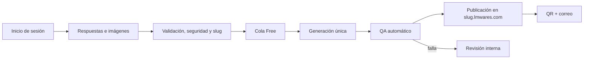
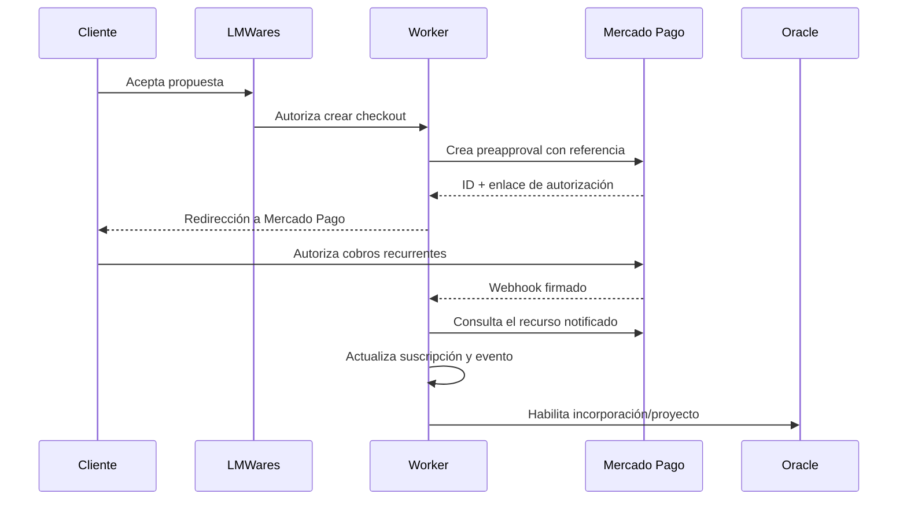
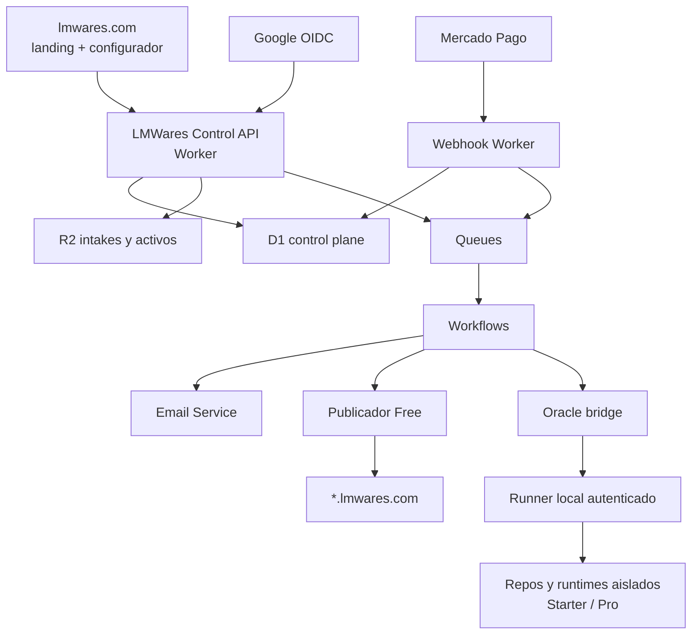

# LMWares: suscripciones, incorporación de clientes y operación con Oracle

Fecha: 2026-07-23  
Estado: visión de producto y arquitectura de operación; implementación
Alcance: LMWares, Mercado Pago, Cloudflare y Oracle. AstraMuses queda fuera de este ciclo:
se mostrará como `Próximamente`, se usará internamente para promocionar LMWares
con contenido SaaS UGC y no podrá seleccionarse, cotizarse ni cobrarse.

## 1. Decisión ejecutiva

LMWares debe separar cinco momentos que hoy pueden parecer una sola compra:

1. La persona se identifica.
2. Configura y previsualiza el sistema que necesita.
3. LMWares revisa el alcance y confirma qué se construirá.
4. El cliente paga la implementación y, si corresponde, autoriza una suscripción de mantenimiento.
5. Oracle convierte el acuerdo en un proyecto ejecutable, con fases, evidencia y aprobaciones.

El configurador no debe desplegar directamente un proyecto Starter o Pro. Su
salida es una intención comercial estructurada. Cuando LMWares la aprueba, esa
intención se convierte en un contrato WARE y en un proyecto real.

Free es la excepción: por ser una página informativa de una sola iteración, sí
puede entrar directamente a una cola automatizada después del inicio de sesión,
la validación de datos y la aceptación de términos.

## 2. Tesis de producto

### Misión propuesta

Convertir una necesidad concreta de un negocio en un sistema web ligero,
comprensible y operable, sin obligarlo a pagar por una plataforma más grande de
lo que necesita.

### Visión propuesta

Construir una fábrica de software asistida por agentes donde cada cliente pueda
describir, visualizar y contratar una herramienta web; Oracle transforma esa
intención en un producto reproducible, verificable y desplegado sobre una
infraestructura conocida.

### Promesa comercial

> Construimos el sistema que necesitas hoy y te dejamos decidir cuánto
> acompañamiento necesitarás después.

El pago inicial cubre la implementación y la licencia de uso para el negocio.
La suscripción mensual cubre trabajo y acompañamiento posteriores. No es una
renta para conservar la licencia.

## 3. Catálogo de planes

| Plan | Resultado inicial | Módulos | Publicación | Administración | Marketing |
| --- | --- | --- | --- | --- | --- |
| Free | Página informativa de una sola pantalla y una sola generación | Contacto, redes, texto esencial, hasta 10 imágenes de 5 MB | `slug.lmwares.com` | Sin portal operativo; sólo estado, enlace y QR | No |
| Starter | Landing + panel + hasta 2 complementos | Blog, Galerías, Catálogo, Formulario, Eventos o Docs | Empieza en `slug.lmwares.com`; dominio personalizado opcional después | Según mantenimiento | Posible en el futuro |
| Pro | Sistema completo configurable | Todo Starter + Carrito + Optimization | Empieza en `slug.lmwares.com`; dominio personalizado opcional después | Según mantenimiento | Posible en el futuro |

Reglas ya acordadas:

- Landing y Panel forman la base de Starter y Pro.
- Starter permite hasta dos complementos.
- Carrito y Optimization requieren Pro.
- Para el lanzamiento inicial, Pro se ofrece como Pro base con cualquier
  combinación de módulos Starter. Carrito y Optimization permanecen visibles
  como `Próximamente`, pero no pueden seleccionarse, cotizarse ni cobrarse.
- Cuando estén disponibles, Carrito y Optimization serán ampliaciones de pago
  para proyectos Pro; no se consideran incluidos retroactivamente.
- AstraMuses no forma parte del lanzamiento conjunto. Cualquier campo legado de
  marketing se conserva únicamente por compatibilidad histórica; las nuevas
  solicitudes y ofertas deben congelarlo en `false`.
- Starter y Pro pueden contratarse como pago único fijando la mensualidad final
  en MXN $0. En ese caso la publicación no crea ni exige una suscripción.
- Todos los planes se despliegan primero en un subdominio LMWares.
- Starter y Pro pueden migrar después a un dominio personalizado.
- El dominio final no sustituye el subdominio; éste conserva valor como ruta de
  revisión, recuperación y operación administrada.
- El pago de la fase 1 crea una entidad de proyecto del cliente separada del
  registro técnico `lmwares_projects`; el sitio puede mostrar “preparando” antes
  de que un operador enlace el repositorio de Oracle.
- Compartir el patrón público `slug.lmwares.com` no elimina el aislamiento
  técnico de Starter y Pro: cada proyecto pagado conserva su propio contrato,
  repositorio, runtime y recursos cuando corresponda.

## 4. Dos capas distintas: plan y acompañamiento

El plan define qué sistema se construye. El acompañamiento define quién lo
opera después.

### 4.1 Mantenimiento básico: autogestión

El cliente recibe el portal completo correspondiente a sus módulos:

- Blog: crear, editar y programar publicaciones.
- Galerías: cargar, ordenar, retirar y describir piezas.
- Catálogo: crear y actualizar elementos, atributos y disponibilidad.
- Formulario: revisar solicitudes y cambiar su estado.
- Eventos: crear, programar y cerrar eventos.
- Docs: crear y mantener documentación.
- Carrito: revisar pedidos, estados y precios, si forma parte de Pro.
- Optimization: ver resultados y recomendaciones, si forma parte de Pro.

La landing no se edita directamente. Los cambios de estructura o dirección
visual se solicitan a LMWares.

### 4.2 Mantenimiento avanzado: operación administrada

El cliente recibe una consola reducida:

- Solicitar cambios.
- Adjuntar referencias.
- Aprobar o rechazar propuestas.
- Consultar avances.
- Ver resultados de Optimization.
- Revisar facturación, dominio y estado del servicio.

Un agente u operador de LMWares utiliza la consola completa para actualizar
contenido, ejecutar revisiones, atender solicitudes y mantener el sistema.

### 4.3 Optimization tiene dos caras

- **Cliente:** resultados, tendencias, hipótesis aprobadas y cambios observados.
- **Agente LMWares:** señales, evidencia, razonamiento, experimentos,
  restricciones y acciones.

El cliente no necesita operar el motor de optimización. Necesita comprender qué
se aprendió, qué se hizo y qué resultado produjo.

## 5. Flujo completo del cliente

### 5.0 Proyecto y subdominio desde la fase 1

La confirmación idempotente de la primera fase crea el proyecto Starter del
cliente y reserva un slug estable bajo `*.lmwares.com`. La URL puede mostrar
una página de preparación mientras el operador enlaza el proyecto técnico y
avanza las fases. Esa entidad no es un repositorio, no concede permisos por sí
misma y no se inserta en `lmwares_projects`.

El dominio personalizado se solicita al final del ciclo. En la primera versión
sólo se aceptan subdominios delegados (`www.` o `app.`), se verifica con CNAME/TXT
y se mantiene el subdominio LMWares como fallback. La activación automática de
DNS, SSL y routing queda bloqueada hasta seleccionar y configurar un proveedor.

### 5.1 Identidad

Para el primer ciclo conviene usar Google OpenID Connect con los scopes mínimos
`openid profile email`. El identificador interno debe basarse en el `sub`
estable del proveedor, no en el correo, porque el correo puede cambiar.

OAuth de LMWares sólo identifica a la persona y crea su sesión. No autoriza
cobros ni sustituye el consentimiento de Mercado Pago.

### 5.2 Configuración

El configurador conserva:

- Plan elegido.
- Módulos.
- Modalidad de mantenimiento deseada.
- Datos básicos del negocio.
- Contacto preferido.
- Subdominio deseado.
- Dominio existente o por adquirir.
- Descripción del objetivo.
- Referencias e imágenes.
- Previsualización revisada.
- Consentimientos y versión de términos aceptada.

La acción final debe ser **Enviar mi configuración**, no “comprar” todavía.

### 5.3 Revisión humana

Oracle crea un registro de incorporación y lo coloca en la cola comercial.
LMWares realiza mensaje o llamada, valida el alcance y decide:

- Aceptar tal como está.
- Recomendar otro plan.
- Solicitar información.
- Cotizar un trabajo adicional.
- Rechazar un caso fuera de alcance.

### 5.4 Propuesta y pago

La propuesta debe separar:

- Implementación inicial: cobro único.
- Mantenimiento básico o avanzado: suscripción mensual.
- Costos externos: dominio, capacidad extraordinaria, correo, servicios de
  terceros o integraciones.
- Trabajo fuera de alcance: por evento o por proyecto.

Sólo después de aceptar el alcance se genera el enlace de pago o autorización
de suscripción.

### 5.5 Conversión a proyecto

Al confirmarse el pago requerido:

1. La configuración aceptada se congela como revisión comercial.
2. Oracle genera el borrador `*.ware.md`.
3. Un humano confirma alcance, exclusiones y criterios de aceptación.
4. Oracle produce `ware.lock.json`.
5. Se crea el repo derivado sobre `cloudflare-starter-v01`.
6. El proyecto avanza por contrato, experiencia visual, operación local,
   validación y staging.

## 6. Flujo Free

### 6.1 Información solicitada

El formulario debe ser corto y producir una página útil en una sola iteración:

1. Nombre público del negocio o “Tu marca aquí”.
2. Qué hace y para quién.
3. Acción principal: llamar, escribir, visitar, reservar o consultar.
4. Descripción breve de productos o servicios.
5. Ciudad o zona de atención, si aplica.
6. Teléfono, correo, WhatsApp y redes que desea publicar.
7. Horario, si aplica.
8. Hasta 10 imágenes, máximo 5 MB por archivo.
9. Tono visual entre un grupo pequeño de direcciones predefinidas.
10. Subdominio deseado y alternativas.

No debe preguntar lo mismo de varias maneras ni ofrecer un editor completo.

### 6.2 Pipeline



Estados sugeridos:

`draft → submitted → queued → generating → validating → published → notified`

Estados de excepción:

`needs_information`, `generation_failed`, `moderation_hold`, `manual_review`.

### 6.3 Arquitectura Free

Free no debe crear un repo, Worker, D1 y R2 independientes por persona. Debe
funcionar como un servicio multiusuario de publicación:

- D1 central: identidad, intake, slug, estado y manifiesto.
- R2 central: imágenes originales, derivados y artefacto publicado.
- Worker wildcard: resuelve `slug.lmwares.com`.
- Queue: desacopla recepción, generación y notificación.
- Workflow: coordina pasos durables, reintentos y espera de revisión si algo
  falla.
- Servicio de correo: envía publicación, QR y estado.

La salida puede ser HTML estático con un manifiesto pequeño. No necesita un
panel administrativo ni una base de datos por página.

### 6.4 Límites que deben ser explícitos

- Una sola generación.
- Sin revisiones incluidas.
- Sin dominio personalizado.
- Sin panel.
- Sin formularios que almacenen solicitudes.
- Sin e-commerce.
- Sin garantía de disponibilidad empresarial.
- Política de uso aceptable, eliminación y contenido prohibido.
- Caducidad o conservación de páginas inactivas por definir.

## 7. Flujo Starter y Pro

Estados sugeridos:

```text
draft
→ configured
→ submitted
→ contact_pending
→ scope_review
→ proposal_sent
→ awaiting_payment
→ accepted
→ provisioning
→ in_build
→ client_review
→ staging
→ live
→ maintenance
```

Estados comerciales y técnicos no deben mezclarse. Por ejemplo, una
suscripción puede estar `paused` mientras el proyecto sigue `live`, dentro de
un periodo de gracia.

Cada proyecto pagado conserva aislamiento:

- Repo propio.
- Contrato WARE propio.
- D1 y R2 propios cuando los necesite.
- Portal y API privados.
- Secretos por proyecto.
- Dominio y políticas de acceso propios.
- Evidencia y despliegues propios.

## 8. Mercado Pago

### 8.1 Producto recomendado

Mercado Pago ofrece una API de Suscripciones con:

- Suscripciones (`/preapproval`).
- Planes reutilizables (`/preapproval_plan`).
- Facturas o cobros autorizados (`/authorized_payments`).
- Pagos vinculados.

Para LMWares hay dos estrategias válidas:

#### Planes fijos

Usar planes asociados cuando el monto y la periodicidad sean iguales para un
grupo: por ejemplo, “Starter básico mensual” o “Pro avanzado mensual”.

#### Suscripción personalizada

Usar una suscripción sin plan asociado cuando el monto dependa del alcance,
capacidad o acuerdo individual. En estado `pending`, Mercado Pago permite
compartir un enlace para que el cliente elija el medio de pago.

### 8.2 Recomendación para el MVP

1. Crear una suscripción sin plan asociado y en estado `pending` por cada
   propuesta aprobada. Así el monto y la referencia pertenecen al cliente real,
   y Mercado Pago devuelve un enlace de autorización.
2. Cobrar la implementación inicial por separado.
3. Programar el comienzo del mantenimiento en la fecha acordada de staging,
   entrega o publicación; no cobrar meses de mantenimiento de un sistema que
   todavía no existe.
4. No crear la suscripción hasta que LMWares apruebe el alcance.
5. Guardar un `external_reference` interno que vincule cliente, propuesta y
   proyecto sin exponer información sensible.

Cuando precios, alcance y fechas estén estandarizados, pueden crearse cuatro
planes reutilizables: Starter básico, Starter avanzado, Pro básico y Pro
avanzado. Mercado Pago devuelve un `init_point` para un plan, pero el flujo
personalizado conserva mejor la trazabilidad individual durante la etapa
orgánica.

### 8.3 Flujo de autorización



La página de retorno mejora la experiencia, pero no es evidencia suficiente
del pago. La fuente de verdad debe ser el estado consultado a Mercado Pago
después de validar el webhook.

### 8.4 Eventos mínimos

Escuchar y reconciliar:

- `subscription_preapproval`: alta o cambio de suscripción.
- `subscription_authorized_payment`: cobro recurrente.
- `payment`: estado final del pago cuando corresponda.
- Reclamos, reembolsos y contracargos cuando se habiliten.

El receptor debe:

1. Validar `x-signature`.
2. Registrar el ID del evento antes de procesarlo.
3. Responder rápido con 200/201.
4. Consultar el recurso a la API de Mercado Pago.
5. Aplicar la transición de estado de manera idempotente.
6. Enviar el trabajo posterior a una Queue.

### 8.5 Estados internos de suscripción

No copiar ciegamente los estados del proveedor a la lógica del producto.
Mantener una traducción interna:

| Estado interno | Efecto |
| --- | --- |
| `pending_authorization` | No iniciar mantenimiento |
| `active` | Servicio recurrente habilitado |
| `payment_attention` | Avisar y abrir periodo de gracia |
| `paused` | Suspender trabajo nuevo; no borrar el proyecto |
| `canceled` | Finalizar renovaciones y aplicar política de cierre |
| `disputed` | Congelar acciones irreversibles y revisar |

### 8.6 Reconciliación

Los webhooks no deben ser el único mecanismo:

- Reconciliación programada de suscripciones activas.
- Consulta de cobros recientes.
- Panel interno de eventos no conciliados.
- Reprocesamiento manual seguro.
- Registro append-only de eventos originales y decisiones.

### 8.7 Pruebas

Antes de producción:

- Aplicación y credenciales de prueba.
- Usuario vendedor y comprador de prueba del mismo país.
- Compra aprobada, rechazada y pendiente.
- Webhook válido, firma inválida y evento duplicado.
- Retraso, reintento y llegada fuera de orden.
- Pausa, reactivación y cancelación.
- Cambio de monto sólo con política y consentimiento definidos.
- Diferencia entre retorno del navegador y confirmación real.

## 9. Arquitectura Cloudflare propuesta



### 9.1 Componentes

- **Public web:** marketing, login, configurador, preview y estado.
- **Control API Worker:** sesiones, intake, propuestas, acciones autorizadas y
  lectura del estado.
- **Webhook Worker:** endpoint mínimo, aislado y sin interfaz.
- **D1 control plane:** identidad, proyectos, propuestas, suscripciones,
  eventos, trabajos y auditoría.
- **R2:** imágenes, adjuntos, artefactos Free y evidencia.
- **Queues:** generación, correo, reconciliación y puente con Oracle.
- **Workflows:** procesos de varios pasos que deben sobrevivir reintentos y
  pausas.
- **Email Service:** notificaciones transaccionales desde el dominio.
- **Turnstile:** defensa de formularios públicos, validado en servidor.
- **Oracle runner:** proceso privado que reclama trabajos aprobados mediante
  conexión saliente; el Worker no accede a `C:\dev`.

### 9.2 Subdominios y dominios

- Free: `slug.lmwares.com` mediante DNS/ruta wildcard.
- Starter/Pro: subdominio administrado desde el inicio.
- Dominio personalizado: onboarding manual primero; Cloudflare for SaaS cuando
  se busque escalar.

Para el primer MVP conviene admitir primero `www.cliente.com` o
`app.cliente.com` mediante CNAME. El dominio raíz puede requerir decisiones
adicionales según el proveedor DNS y la modalidad de Cloudflare.

### 9.3 Datos centrales sugeridos

- `users`
- `identities`
- `sessions`
- `organizations`
- `package_drafts`
- `package_modules`
- `intakes`
- `proposals`
- `proposal_revisions`
- `subscriptions`
- `subscription_events`
- `payments`
- `projects`
- `project_members`
- `project_jobs`
- `domains`
- `assets`
- `notifications`
- `terms_acceptances`
- `audit_events`

No almacenar datos de tarjeta. LMWares sólo conserva identificadores y estados
del proveedor.

## 10. Contrato entre la web y Oracle

El configurador debe emitir un objeto de incorporación versionado, no un prompt:

```yaml
schema: lmwares.intake/v1
customer: <internal-user-id>
business:
  publicName: Tu marca aquí
  objective: captar solicitudes
package:
  plan: starter
  modules:
    - landing
    - panel
    - catalog
    - quote
  maintenance: basic
publishing:
  lmwaresSubdomain: negocio
  customDomainRequested: true
status: submitted
```

Después de la revisión comercial, Oracle lo transforma en un WARE. El intake
conserva lo que pidió el cliente; el WARE conserva lo que LMWares aceptó
construir. Nunca deben sobreescribirse entre sí.

## 11. Seguridad y privacidad

Requisitos mínimos:

- OAuth/OIDC con `state`, nonce, redirect URIs exactos y cookies seguras.
- Usar el `sub` del proveedor como identidad externa estable.
- Sesiones revocables y rotación.
- Separar secretos de Mercado Pago, Google y Cloudflare por ambiente.
- Webhooks firmados y procesamiento idempotente.
- Turnstile validado en el Worker.
- Límites por usuario, IP, cuenta y tamaño de archivos.
- Validar MIME real, dimensiones y contenido de archivos.
- URLs de carga temporales y de alcance mínimo.
- Consentimiento para publicar datos de contacto.
- Política de privacidad, términos, cancelación y tratamiento de datos.
- Auditoría de cambios, pagos, aprobaciones y despliegues.
- No exponer secretos en `VITE_*`, navegador, logs o WARE.

Cloudflare Queues ofrece entrega al menos una vez; por eso cada trabajo necesita
un ID estable y deduplicación. Los pagos, correos y publicaciones no pueden
depender de que un mensaje llegue exactamente una vez.

## 12. Decisiones comerciales pendientes

Antes de producción deben fijarse:

1. Precio de implementación por plan.
2. Precio de mantenimiento básico y avanzado.
3. Qué variantes se vuelven planes fijos de Mercado Pago.
4. Momento exacto del primer cobro mensual.
5. Periodo de gracia ante rechazo.
6. Política de pausa, cancelación, reembolso y contracargo.
7. Qué ocurre con el dominio y el portal al cancelar.
8. Capacidad incluida y costo de escalamiento.
9. Tiempos de respuesta de mantenimiento.
10. Solicitudes u horas incluidas por mes.
11. Exportación y eliminación de datos.
12. Retención de páginas Free inactivas.
13. Moderación y uso aceptable para Free.
14. Facturación fiscal y documentación contractual aplicable.
15. Transferencia del negocio, cambio de titular y sucursales.

## 13. Qué no automatizar todavía

- Aprobación del alcance Starter/Pro.
- Cotización especial.
- Compra o transferencia de dominios.
- Creación de recursos pagados.
- Publicación de datos reales sin revisión.
- Cambios de precio de una suscripción.
- Cancelación irreversible o eliminación de datos.
- Diseño final de la landing.
- Decisiones y experimentos de Optimization.

La automatización inicial debe reducir trabajo repetitivo, no eliminar los
controles donde LMWares todavía necesita criterio.

## 14. Roadmap recomendado

### Etapa 0 — Cierre de reglas

- Precios.
- Alcance por plan.
- Mantenimiento básico/avanzado.
- Términos, privacidad y cancelación.
- Política Free.

### Etapa 1 — Incorporación orgánica

- Google OIDC.
- Configurador persistido.
- Intake y cola comercial en Oracle.
- Revisión humana.
- Enlaces de Mercado Pago generados tras aprobación.
- Webhooks, estados y reconciliación.

### Etapa 2 — Free automático

- Intake corto.
- R2 y validación de imágenes.
- Queue + Workflow.
- Generación única.
- Wildcard publisher.
- QR y correo.
- Cola de excepción.

### Etapa 3 — Starter/Pro asistidos

- Generación de contrato WARE desde intake aprobado.
- Creación guiada de repo.
- Seguimiento de fases.
- Subdominio administrado.
- Portal según mantenimiento.

### Etapa 4 — Dominios y operación

- Cloudflare for SaaS.
- Onboarding de CNAME y verificación.
- Panel de dominio.
- Métricas de capacidad.
- Renovaciones, pausas y cierre.

### Etapa 5 — Automatización creciente

- Biblioteca versionada de módulos.
- Ensamblado repetible.
- Validación visual y funcional automatizada.
- Recomendación de plan basada en intención.
- Optimization como WARE de servicio.

## 15. Criterio de éxito del primer MVP

El MVP está listo para recibir clientes cuando puede demostrar:

1. Un usuario entra con Google.
2. Configura y previsualiza su paquete.
3. La configuración llega a una cola interna sin perderse.
4. LMWares puede revisarla, modificar la propuesta y contactar al cliente.
5. El cliente autoriza una suscripción real mediante Mercado Pago.
6. Un webhook firmado actualiza el estado sin duplicarlo.
7. Oracle crea un proyecto sólo después de la aprobación correspondiente.
8. El cliente puede ver el estado de su incorporación.
9. Cancelación o pago fallido no borra ni rompe automáticamente su sistema.
10. Hay evidencia auditable desde configuración hasta publicación.

## 16. Fuentes oficiales consultadas

Mercado Pago:

- [Resumen de Suscripciones](https://www.mercadopago.com.mx/developers/es/docs/subscriptions/overview)
- [Referencia de la API de Suscripciones](https://www.mercadopago.com.mx/developers/es/reference/online-payments/subscriptions/overview)
- [Suscripciones con plan asociado](https://www.mercadopago.com.mx/developers/es/docs/subscriptions/integration-configuration/subscription-associated-plan)
- [Suscripciones sin plan y pago pendiente](https://www.mercadopago.com.mx/developers/es/docs/subscriptions/integration-configuration/subscription-no-associated-plan/pending-payments)
- [Gestión de suscripciones](https://www.mercadopago.com.mx/developers/en/docs/subscriptions/subscription-management)
- [Webhooks y validación de firma](https://www.mercadopago.com.mx/developers/es/docs/subscriptions/additional-content/your-integrations/notifications/webhooks)
- [Prueba de suscripciones](https://www.mercadopago.com.mx/developers/es/docs/subscriptions/integration-test/payment-approval)

Cloudflare:

- [Workers: buenas prácticas de arquitectura](https://developers.cloudflare.com/workers/best-practices/workers-best-practices/)
- [D1](https://developers.cloudflare.com/d1/)
- [R2: URLs firmadas](https://developers.cloudflare.com/r2/api/s3/presigned-urls/)
- [Queues: garantías de entrega](https://developers.cloudflare.com/queues/reference/delivery-guarantees/)
- [Queues: reintentos y dead-letter queues](https://developers.cloudflare.com/queues/configuration/batching-retries/)
- [Workflows](https://developers.cloudflare.com/workflows/get-started/guide/)
- [Email Service](https://developers.cloudflare.com/email-service/get-started/send-emails/)
- [Cloudflare for SaaS](https://developers.cloudflare.com/cloudflare-for-platforms/cloudflare-for-saas/)
- [Turnstile: validación en servidor](https://developers.cloudflare.com/turnstile/get-started/server-side-validation/)

Identidad:

- [Google OpenID Connect](https://developers.google.com/identity/openid-connect/openid-connect)
- [Referencia de claims de Google](https://developers.google.com/identity/openid-connect/reference)

Este informe no sustituye revisión contable, fiscal, contractual ni de
protección de datos antes de recibir pagos de producción.
